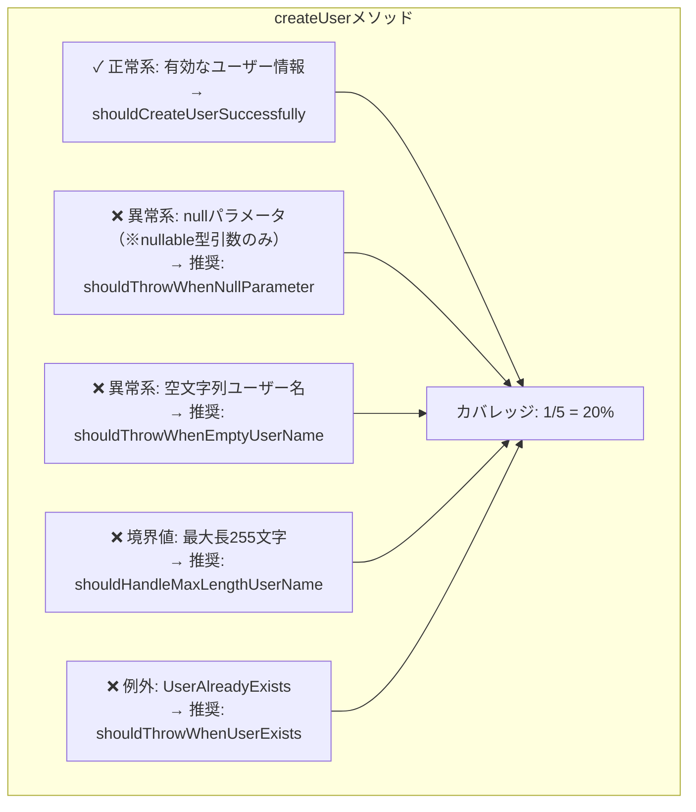
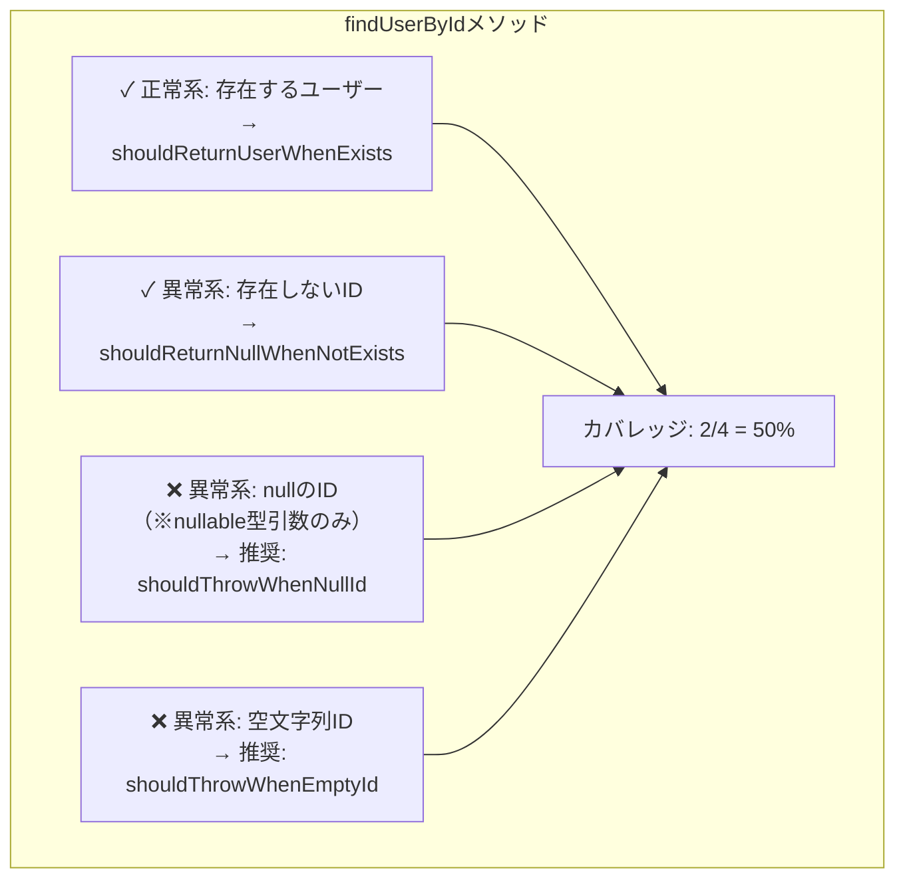

# test-review - テストコードレビューを行い、未実装のテストケースを洗い出します

## 概要
指定されたテストクラスを分析し、テストカバレッジの網羅性をレビューします。テスト駆動開発の専門家の視点に基づいてテストの品質を評価し、実装済みテストケースと未実装領域を可視化したMermaid図を生成して、具体的な改善提案を行います。

### 主要機能
- **カバーすべきテスト項目の明確化**: テスト対象の責務から必須テスト項目を自動導出
- **詳細なカバー状況の可視化**: 全体/カテゴリ別/優先度別のカバレッジ率を算出
- **未実装テストの優先度付け**: ビジネスクリティカルな観点から改善提案を生成

## 使用方法
```
/test-review <TestClassPath> [-u|-s]
```

### オプション
- `-u` または省略: 単体テスト観点でレビュー（デフォルト）
- `-s`: シナリオテスト観点でレビュー

### 使用例
```bash
# 単体テスト観点でのレビュー（デフォルト）
/test-review /path/to/UserServiceTest.kt

# 単体テスト観点でのレビュー（明示的指定）
/test-review /path/to/UserServiceTest.kt -u

# シナリオテスト観点でのレビュー
/test-review /path/to/UserRegistrationTest.kt -s
```

### 観点別の分析内容

#### 単体テスト観点 (unit)
- **焦点**: 個々のメソッド・関数の振る舞いと境界値
- **評価基準**:
  - 各メソッドの全分岐網羅
  - 境界値・異常値のテスト
  - 依存関係の適切なモック化
  - エラーハンドリングの網羅性
- **推奨テストケース**:
  - null値のハンドリング（nullable型引数の場合のみ対象）
  - 空値のハンドリング（空文字列、空リスト、空配列など）
  - 境界値（最小値、最大値、境界±1）
  - 例外ケース（IOException、TimeoutException等）
  - 各条件分岐のテスト
- **例外処理のテストカウント基準**:
  - 同一の例外タイプが異なるステータスコードで発生しても、処理が分岐しない場合は1つのテストケースとしてカウント
  - 例：ApiException(500)とApiException(404)が同じように伝播される場合は「APIエラー時の例外伝播」として1つとカウント
  - 処理が分岐する場合のみ別々のテストケースとしてカウント
- **無意味なテストの禁止**:
  - モックの設定通りの動作を確認するだけのテストは提案しない
  - 外部システムの仕様をテスト対象クラスのテストとして提案しない
  - テスト対象クラスが実装していない責務のテストは提案しない

#### シナリオテスト観点 (scenario)
- **焦点**: ユーザーストーリーやビジネスフローの実現
- **評価基準**:
  - エンドツーエンドのユースケース網羅
  - ビジネスルールの検証
  - 実際の利用シナリオの再現性
  - 複数機能の連携動作
- **推奨テストケース**:
  - ハッピーパス（正常系の一連の流れ）
  - 代替フロー（条件分岐を含むシナリオ）
  - エラーリカバリーシナリオ
  - 実際のユーザー操作を模したフロー

## 実行内容
1. テストクラスの読み込みと詳細解析
2. テストメソッドごとの具体的なシナリオ抽出
3. テストカバレッジの計算と未実装領域の特定
4. カテゴリ別に分割された複数のMermaid図生成
5. テストカバレッジ統計とサマリーの作成
6. 優先度別改善提案の生成
7. 専門家の視点でのテストレビューと改善提案

## プロンプト
まず、コマンドライン引数を解析してください：
- テストクラスパス: 第1引数
- 観点オプション: 
  - `-u` または オプションなし → 単体テスト観点（unit）
  - `-s` → シナリオテスト観点（scenario）

選択された観点（単体テスト or シナリオテスト）に基づいて、指定されたテストクラスをレビューし、テストカバレッジの網羅性を評価してMermaid形式の可視化図を生成してください。

**重要な注意事項**:
- **型安全性**: nullable型引数の場合のみnullテストを提案する
- **例外処理統合**: 処理が同じ例外は統合し、過剰な分割を避ける
- **無意味なテスト禁止**: モック設定通りの動作確認や外部システム仕様のテストは提案しない

### テスト駆動開発の専門家によるレビュー

まず、`~/workspace/cc-knowledge/docs/guidelines/testing.md`のテストガイドラインを参照し、プロジェクトのテスト基準を把握してください。

その上で、選択された観点に応じて、以下のようにテスト駆動開発の専門家の思考パターンとTDDの哲学を適用してテストコードをレビューしてください：

**観点別のレビュー重点：**

【単体テスト観点の場合】
- メソッド単位での完全性を重視
- モックの適切な使用と依存性の分離を評価
- 境界値テストの網羅性を詳細にチェック
- 各分岐条件のテストカバレッジを厳密に評価

【シナリオテスト観点の場合】
- ビジネス価値の実現度を重視
- ユーザーストーリーの再現性を評価
- 複数コンポーネントの統合動作を確認
- 実際の利用フローとの一致度をチェック

**専門家の視点でのレビュー基準：**

1. **テストの意図の明確性**
   - テスト名は「何をテストしているか」が一目で分かるか
   - テストが失敗した時、何が問題かすぐに理解できるか
   - Arrange-Act-Assertパターンが明確に分離されているか

2. **テストファーストの原則**
   - テストが実装の設計を導いているか
   - テストが仕様書として機能しているか
   - 過度に実装に依存していないか

3. **テストの保守性**
   - DRYではなくDAMP（Descriptive And Meaningful Phrases）を優先しているか
   - テストの重複は明示性のために許容されているか
   - セットアップが複雑すぎないか

4. **テストの信頼性**
   - テストは決定的（非決定的要素がない）か
   - 外部依存を適切にモック/スタブ化しているか
   - テストの実行順序に依存していないか

5. **TDDのリズム**
   - Red-Green-Refactorのサイクルが感じられるか
   - 最小限のテストから始めて段階的に複雑にしているか
   - 三角測量（Triangulation）が適切に使われているか

**専門家スタイルのレビューコメント例：**
- 「このテストは『何を』ではなく『どのように』をテストしています。仕様に焦点を当てましょう」
- 「テスト名を日本語で書くことで、ビジネス要求との対応が明確になります」
- 「このセットアップは複雑すぎます。Object Motherパターンの導入を検討してください」
- 「境界値テストが不足しています。0、1、多数のケースを必ず含めましょう」

**評価の5段階基準：**
- ⭐⭐⭐⭐⭐（5/5）: TDDの模範的実装。テストが仕様書として完璧に機能
- ⭐⭐⭐⭐☆（4/5）: 良好なテスト実装。軽微な改善点あり
- ⭐⭐⭐☆☆（3/5）: 基本的なテストは実装済み。重要な領域に未テストあり
- ⭐⭐☆☆☆（2/5）: テストが不十分。ビジネスクリティカルな機能が未保護
- ⭐☆☆☆☆（1/5）: テストが極めて不十分。即座の改善が必要

### 通常の分析手順

以下の手順で実行してください：

1. **テストクラスの詳細読み込み**
   - {TestClassPath}を読み込む
   - @Nested内部クラスの構造を把握
   - 各テストメソッドの実装内容を詳細に分析

2. **プロジェクトガイドラインとの照合**
   - `/lint-test <テストファイルパス>`コマンドを実行してガイドライン準拠をチェック
   - チェック結果を後続セクションで活用

3. **テストシナリオの抽出と分類**
   - テスト説明から日本語のテスト説明を抽出
   - パラメータ化テストのパラメータからシナリオを展開
   - 各テストが検証している具体的な条件を特定
   - テストされていない可能性があるシナリオを推測
   
   **カバーすべきテスト項目の特定**：
   - テスト対象クラスのpublicメソッドを全て列挙
   - 各メソッドのシグネチャから必要なテストケースを導出
   - **必須**: メソッドの引数型を厳格に確認し、nullable型の場合のみnullテストを提案
   - コンストラクタ、getter/setter、ビジネスロジックメソッドを分類
   - 依存関係や外部システム連携から必要なモックテストを特定
   - 必須項目の階層構造をMermaid図で可視化
   
   **例外処理テストの統合ルール**：
   - **統合の判断基準**: 同一例外タイプで処理が分岐しない場合は統合してカウント
   - **具体例**：
     - ✅ 統合すべき: ApiException(403), ApiException(500), ApiException(429) → 「APIエラー時の例外伝播」として1つ
     - ❌ 分離すべき: 認証エラー(401)で認証処理、権限エラー(403)で権限チェック処理 → ビジネス処理が異なるため別々
   - **HTTPステータスコード別の例外テスト**：
     - 処理が同じ場合：「APIエラー時の例外伝播（4xx/5xx）」として1つとカウント
     - 処理が異なる場合：「認証エラー（401）」「権限エラー（403）」として別々にカウント
   - 統合された場合はMermaid図でもグループ化して表示

4. **テストカテゴリの特定**
   - 機能別にテストをグループ化（例：依存関係計算、ソート機能など）
   - 各カテゴリ内でのサブカテゴリを識別
   - 正常系、異常系、境界値、パフォーマンステストを分類

5. **メソッド別の見やすい図の生成**
   - 全体図は省略し、メソッド別に分割した複数の図を作成
   - 各メソッドごとに独立したMermaid図を生成
   - 各図は以下の要素を含む：
     ```mermaid
     graph TB
         subgraph "メソッド名"
             TC1_1["✓ 実装済みシナリオ1<br/>→ testMethodName1"]
             TC1_2["✓ 実装済みシナリオ2<br/>→ testMethodName2"]
             TC1_MISSING1["❌ 未実装シナリオ1<br/>→ 推奨: shouldDoSomething"]
             
             Coverage["カバレッジ: X/Y = Z%"]
         end
         
         TC1_1 --> Coverage
         TC1_2 --> Coverage
         TC1_MISSING1 --> Coverage
     ```
   - 実装済みテストには実際のメソッド名を記載
   - 未実装テストには推奨されるメソッド名を提案

6. **テストカバレッジ統計の生成**
   - 数値によるカバレッジサマリーを作成（図は不要）
   - カテゴリ別、メソッド別のカバレッジ率を計算
   - テストタイプ別の分布を表示
   
   **詳細なカバー状況の算出**：
   - カバーすべき項目の総数をカウント（必須/推奨/任意で分類）
   - 実装済みテストケースと必須項目のマッピング
   - カバレッジ率の計算方法：
     - 全体: (実装済み項目数 / カバーすべき全項目数) × 100
     - カテゴリ別: 正常系、異常系、境界値ごとに算出
     - 優先度別: 必須項目のカバー率を最重要指標として扱う
   - 未カバー項目のリスト化と優先度付け

7. **出力構成**
   - チケット番号の取得: ブランチ名やファイルパスから抽出
   - ファイル名: 
     - 単体テスト観点: `{テストクラス名}-unit-review.md`
     - シナリオテスト観点: `{テストクラス名}-scenario-review.md`
   - 保存先: `~/workspace/tasks/{チケット番号}/test-review/`
   - 以下の構成でマークダウンファイルを生成：
     1. **概要とテストの健全性診断**
        - テストクラスの概要
        - 分析観点: 単体テスト観点 or シナリオテスト観点
        - テストピラミッドの観点での評価
        - テストダブルの使用状況
     2. **テスト要件定義とカバー必須項目**
        - メソッド別に分割したMermaid図による詳細分析
        - 各メソッドの実装済み/未実装テストケースの可視化
        - テスト対象クラス/メソッドの責務から導かれる必須テスト項目
        - ビジネス要件から必要とされるテストシナリオ
        - プロジェクトガイドラインで要求されるテスト項目
        - 観点別の必須カバー項目：
          - 【単体テスト観点】各メソッドの全分岐、境界値、例外処理、空値、null値（※nullable型引数のみ厳格適用）
          - 【シナリオテスト観点】主要ユースケース、代替フロー、エラーリカバリー
     3. **カバー状況**
        - 全体カバレッジ: X/Y項目 (Z%)
        - カテゴリ別カバー状況:
          - 正常系: X/Y項目 (Z%)
          - 異常系: X/Y項目 (Z%)
          - 境界値: X/Y項目 (Z%)
        - 優先度別カバー状況:
          - 必須項目: X/Y項目 (Z%)
          - 推奨項目: X/Y項目 (Z%)
          - 任意項目: X/Y項目 (Z%)
        - 未カバー項目の一覧（優先度順）
     4. **プロジェクトガイドライン準拠チェック**
        - `/lint-test <テストファイルパス>`コマンドを実行してガイドライン準拠をチェック
        - チェック結果を「プロジェクトガイドライン準拠チェック」セクションに含める
        - 準拠状況の報告：
          - 準拠している項目：✅
          - 準拠していない項目：❌
          - 改善が推奨される項目：⚠️
          - 具体的な改善提案
        - ガイドライン違反項目の要約とリファクタリング提案
     5. **総合レビュー**
        - 総合評価（5段階）
        - TDDの観点での良い点・改善点
        - 最重要改善ポイント3つ
     6. **テスト網羅性マトリクス**
        - 機能 × テストタイプ（正常系/異常系/境界値）のマトリクス表
        - 各セルに実装状況を表示（✅/❌）
     7. **Red-Green-Refactorサイクルでの実装提案**
        - 優先度別（🔴/🟡/🟢）改善提案
        - 各提案にRed→Green→Refactorの段階的実装例
     8. **テストのリファクタリング提案**
        - 既存テストの改善点
        - テストの可読性向上案
        - テストヘルパーの最適化案

8. **図の要素と記法**
   - 実装済みテスト: `["✓ テスト内容<br/>→ 実際のメソッド名"]`
   - 未実装の可能性: `["❌ テスト内容<br/>→ 推奨: 推奨メソッド名"]`
   - カバレッジ表示: `[カバレッジ: 実装数/総数 = パーセント%]`
   - カテゴリ: `subgraph`で階層的に表現
   - 依存関係: `-->`で表現
   - メソッド名の表記:
     - 実装済み: 実際のテストメソッド名を`→`の後に記載
     - 未実装: 推奨されるメソッド名を`→ 推奨:`の後に記載

9. **カバレッジ分析の詳細度**
   【単体テスト観点の場合】
   - 各メソッドの全分岐パスを詳細に分析
   - 境界値テスト（最小値-1、最小値、最大値、最大値+1）の完全性
   - 特殊値の網羅性:
     - null値：nullable型引数の場合のみ厳格に適用
     - 空値：空配列、空文字列、空リスト等（型に関係なく適用）
   - 例外処理の全パターン（チェック例外、非チェック例外）
     - 重要：処理が分岐しない同一例外タイプは1つとしてカウント
     - 例：ApiException(4xx/5xx)が全て同じ処理なら「APIエラー処理」として1つ
   - モックオブジェクトの振る舞い検証の適切性
   
   【シナリオテスト観点の場合】
   - ユーザーストーリーごとのカバレッジ
   - ハッピーパスと代替パスの網羅性
   - エラー発生時のリカバリーシナリオ
   - 実際のビジネスフローとの対応度
   - 複数機能連携時の組み合わせパターン

10. **改善提案の優先度付け**
   【単体テスト観点の場合】
   - 🔴 最優先: 未テストの分岐、境界値の欠落、例外処理の不足
   - 🟡 高優先度: モックの不適切な使用、アサーションの不足
   - 🟢 中優先度: パフォーマンステスト、レアケースの補完
   
   【シナリオテスト観点の場合】
   - 🔴 最優先: 主要ユースケースの欠落、ビジネスルール未検証
   - 🟡 高優先度: エラーリカバリー、代替フローの不足
   - 🟢 中優先度: エッジケース、稀な組み合わせパターン
   
   各優先度の提案には、具体的な実装例のコードを含める
   実装例は、既存のテストパターンに合わせた実践的なものにする

注意事項：
- 各図は画面に収まる適切なサイズに調整
- 実装済み（✓）と未実装（❌）を明確に区別
- カバレッジ率は具体的な数値で表示
- 日本語のテスト説明をそのまま活用
- テストの意図が不明確な場合は、コード内容から推測
- **Mermaidの構文エラーを防ぐための重要な注意点**：
  - ノード内のテキストに括弧`()`を含めない
    - 例: `initialize()メソッド` → `initializeメソッド`
  - サブグラフ名に引用符や特殊文字を含めない
    - 例: `"listAccountsメソッド - 基本機能"` → `listAccounts基本機能`
  - 矢印（`-->`）の接続先ノードは必ず事前に定義する
  - 長いテキストは`<br/>`で改行し、1行を適切な長さに抑える
  - ノード名にスペースや日本語を含む場合は角括弧`[]`で囲む
  - 括弧や引用符はMermaidパーサーエラーの頻繁な原因

11. **ファイル保存時の処理**
    - 保存先ディレクトリ: `~/workspace/tasks/{チケット番号}/test-review/`
    - ファイル名: 
      - 単体テスト観点: `{テストクラス名}-unit-review.md`
      - シナリオテスト観点: `{テストクラス名}-scenario-review.md`

12. **完了**
テストレビューの作成が完了しました。

## テスト駆動開発の専門家メソッドの背景

この機能は、テスト駆動開発（TDD）の専門家のテストに対する哲学と実践的なアプローチを体系化したものです。以下の特徴的な視点を反映しています：

- **テストは仕様書である** - テストコードを読めば、そのコードが何をするべきかが理解できる
- **テストファースト** - 実装前にテストを書くことで、より良い設計に導かれる
- **シンプルで読みやすいテスト** - 複雑なテストは、複雑な実装の兆候
- **継続的なリファクタリング** - Red-Green-Refactorのサイクルを重視

### 出力フォーマットの設計思想

専門家メソッドを取り入れた出力フォーマットの特徴：

1. **テストの健全性を最初に診断** - テストピラミッドやテストダブルの使用状況を評価し、テストの全体的な健康状態を把握
2. **マトリクス形式での網羅性表示** - 機能×テストタイプのマトリクスで、一目で未テスト領域を特定
3. **Red-Green-Refactorの実例** - 単なる実装例ではなく、TDDのサイクルに沿った段階的な実装提案
4. **既存テストのリファクタリング** - 新規テストの追加だけでなく、既存テストの品質向上も重視

このメソッドにより、より質の高いテストコードレビューと改善提案が可能になります。

## 出力例（改善後のセクション抜粋）

### 2. テスト要件定義とカバー必須項目

**テスト対象: UserService クラス**

#### 必須テスト項目（メソッド別詳細）

##### createUserメソッド



##### findUserByIdメソッド



### 3. カバー状況

#### 全体カバレッジ
- **実装済み: 3/9項目 (33.3%)**
- **未実装: 6/9項目**

#### カテゴリ別カバー状況
| カテゴリ | 実装済み | 総数 | カバー率 |
|---------|---------|------|---------|
| 正常系   | 2/2     | 2    | 100%    |
| 異常系   | 1/5     | 5    | 20%     |
| 境界値   | 0/2     | 2    | 0%      |

#### 未カバー項目（優先度順）
1. 🔴 **必須**: createUser - nullパラメータのテスト（※nullable型引数のみ）
2. 🔴 **必須**: createUser - UserAlreadyExistsExceptionのテスト
3. 🟡 **推奨**: createUser - 空文字列ユーザー名のテスト
4. 🟡 **推奨**: findUserById - nullIDのテスト（※nullable型引数のみ）