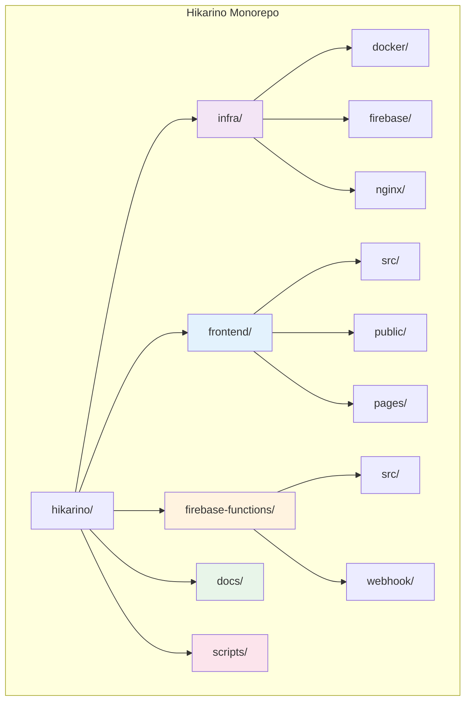
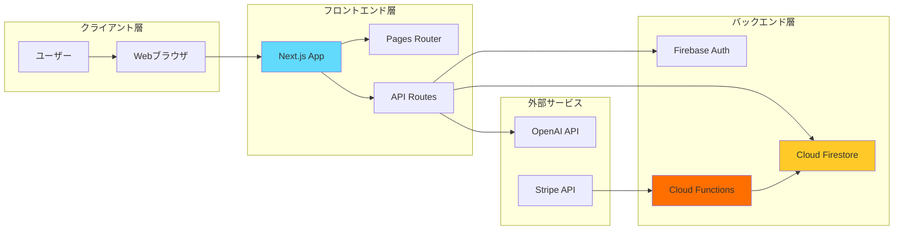
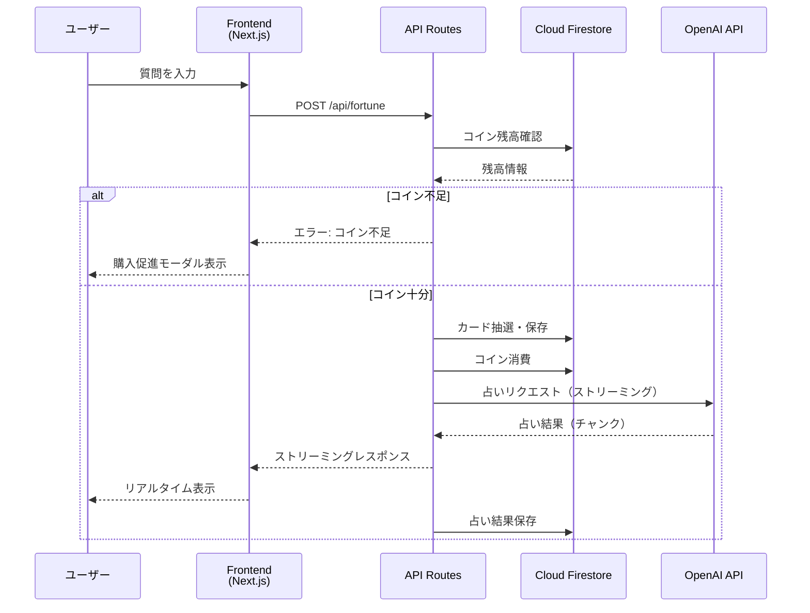
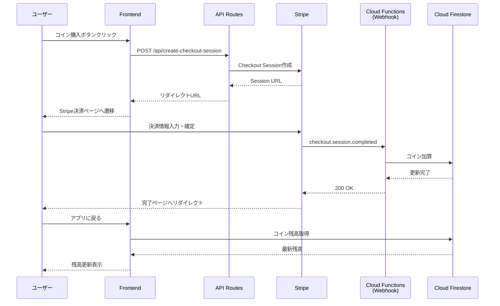

# Hikarino - AIタロット占いサービス

Hikarinoは、Next.jsをベースとしたAIタロット占いWebアプリケーションです。ユーザーが相談内容を入力し、タロットカードを引くことで、OpenAI APIによる占い結果を得られます。

## 目次

- [技術スタック](#技術スタック)
- [システムアーキテクチャ](#システムアーキテクチャ)
- [プロジェクト構造](#プロジェクト構造)
- [セットアップ](#セットアップ)
- [開発ガイド](#開発ガイド)
- [デプロイ](#デプロイ)

## 技術スタック

### フロントエンド

- **Next.js 15** - Reactベースのフルスタックフレームワーク（App Router構成）
- **React 19** - ユーザーインターフェースライブラリ
- **TypeScript 5** - 静的型付けによる開発効率と品質の向上
- **Tailwind CSS 4** - ユーティリティファーストのCSSフレームワーク

### バックエンド

- **Firebase Authentication** - ユーザー認証基盤
- **Cloud Firestore** - NoSQLドキュメントデータベース
- **Firebase Cloud Functions** - サーバーレス関数実行環境
- **OpenAI API** - 占い結果生成のための自然言語処理

### 決済・課金

- **Stripe** - オンライン決済プラットフォーム
- **Stripe Webhook** - 決済イベントの非同期処理

### インフラストラクチャ

- **Docker** - コンテナ仮想化技術
- **Nginx** - 高性能Webサーバー・リバースプロキシ
- **Firebase Hosting** - 静的コンテンツ配信（CDN）

## システムアーキテクチャ

### モノレポ構成

本プロジェクトは、モノレポ（Monorepo）アーキテクチャを採用しています。モノレポとは、複数の関連するプロジェクトを単一のリポジトリで管理する手法です。これにより、コードの共有、一貫性のある開発環境、効率的な依存関係管理が実現できます。



### システム全体像



### データフロー

#### 占い実行フロー



#### コイン購入フロー



## プロジェクト構造

### ディレクトリ構成

```
hikarino/
├── frontend/              フロントエンドアプリケーション
├── firebase-functions/    Cloud Functions（サーバーレス関数）
├── infra/                 インフラストラクチャ設定
│   ├── docker/           コンテナ化設定
│   ├── firebase/         Firebase設定
│   └── nginx/            Webサーバー設定
├── docs/                  プロジェクトドキュメント
├── scripts/               自動化スクリプト
├── package.json          ワークスペース管理
└── README.md             本ドキュメント
```

### 各ディレクトリの詳細

#### frontend/ - フロントエンドアプリケーション

**概要**

ユーザーが直接操作するWebアプリケーション本体です。Next.jsのApp RouterとPages Routerを併用し、最新のReact機能を活用した高速でインタラクティブなUIを提供します。

**責務**

- ユーザー認証フロー（ログイン・サインアップ）
- タロットカード抽選UI
- 占い結果の表示
- 占い履歴の管理・閲覧
- コイン購入フロー
- レスポンシブデザイン対応

**技術的特徴**

関心の分離（Separation of Concerns）原則に基づき、UIコンポーネント、ビジネスロジック、データアクセス層を明確に分離しています。これにより、各層を独立して変更・テストでき、保守性が向上します。

**ディレクトリ構造**

```
frontend/
├── src/
│   ├── app/              Next.js App Router
│   │   ├── page.tsx      トップページ
│   │   ├── history/      占い履歴ページ
│   │   ├── terms/        利用規約
│   │   ├── privacy/      プライバシーポリシー
│   │   └── api/          API Routes
│   ├── components/       UIコンポーネント
│   │   ├── ui/          再利用可能な基本コンポーネント
│   │   ├── Header.tsx   ヘッダー
│   │   └── ...
│   ├── hooks/            カスタムフック
│   │   ├── useAuth.ts   認証状態管理
│   │   └── useFortune.ts 占い機能管理
│   ├── lib/              ユーティリティ・ビジネスロジック
│   │   ├── firebase.ts  Firebase初期化
│   │   ├── tarot.ts     タロットカード定義
│   │   └── firestore/   データベース操作
│   ├── contexts/         React Context（グローバル状態管理）
│   │   └── CoinContext.tsx コイン残高管理
│   ├── types/            TypeScript型定義
│   └── prompts/          AIプロンプトテンプレート
├── public/               静的アセット
│   └── cards/           タロットカード画像
└── package.json
```

**設計パターン**

プレゼンテーション層とロジック層の分離を徹底しています。Reactコンポーネントは表示のみに専念し、ビジネスロジックはカスタムフックやライブラリ関数に集約することで、テスタビリティと再利用性を高めています。

#### firebase-functions/ - Cloud Functions

**概要**

サーバーサイドで実行される処理を管理します。セキュリティ上クライアント側では実行できない処理や、外部サービスとの連携を担当します。

**責務**

- Stripe Webhookの受信・処理
- コイン加算処理
- セキュアな外部API連携
- データ整合性の保証

**なぜCloud Functionsか**

従来のサーバー管理では、スケーリング、パッチ適用、負荷分散などの運用負担が発生します。Cloud Functions（サーバーレスアーキテクチャ）を採用することで、これらの運用タスクをクラウドプロバイダーに委譲し、開発者はビジネスロジックに集中できます。

**セキュリティモデル**

決済処理やコイン管理などの機密性の高い処理は、必ずサーバーサイドで実行します。これにより、クライアント側の改ざんやリバースエンジニアリングから保護できます。

**ディレクトリ構造**

```
firebase-functions/
├── src/
│   ├── index.ts          エントリーポイント
│   ├── webhook/
│   │   ├── server.ts    Expressサーバー設定
│   │   └── stripe.ts    Stripe Webhook処理
│   └── types/           型定義
└── package.json
```

#### infra/ - インフラストラクチャ設定

**概要**

アプリケーションの実行環境を定義する設定ファイルを集約したディレクトリです。Infrastructure as Code（IaC）の思想に基づき、インフラ構成をコードとして管理します。

**なぜ集約するのか**

インフラ設定が散在していると、環境構築やデプロイ時に「どのファイルが必要か」「どの設定を変更すべきか」が不明確になります。infra/配下に集約することで、インフラ関連の変更点を一元管理でき、チーム全体の認識を統一できます。

##### infra/docker/ - コンテナ化設定

**概要**

アプリケーションをDockerコンテナとしてパッケージングするための設定です。

**ファイル構成**

- `Dockerfile` - コンテナイメージのビルド手順
- `docker-compose.yml` - 複数コンテナのオーケストレーション
- `.dockerignore` - コンテナに含めないファイルのリスト

**コンテナ化の利点**

開発環境と本番環境の差異を最小化し、「私の環境では動くのに本番では動かない」という問題を解決します。コンテナは、アプリケーションとその依存関係を一つのパッケージとして扱うため、環境間の移植性が向上します。

**技術的背景**

Dockerは、Linuxのcgroupsとnamespaces機能を利用した軽量な仮想化技術です。従来の仮想マシンと比較して、起動が高速でリソース効率が良いという特徴があります。

##### infra/firebase/ - Firebase設定

**概要**

Firebase（Googleの提供するmBaaS: mobile Backend as a Service）の設定を管理します。

**ファイル構成**

- `firebase.json` - Firebaseプロジェクトの全体設定
- `.firebaserc` - 使用するFirebaseプロジェクトID
- `firestore.rules` - Firestoreセキュリティルール
- `firestore.rules.suggestion` - セキュリティルール改善案
- `.gcloudignore` - デプロイ時の除外ファイル

**セキュリティルールの重要性**

`firestore.rules`は、データベースへのアクセス制御を定義します。「誰が」「どのドキュメントに」「どのような操作（読み取り・書き込み）ができるか」をルールベースで記述します。適切なルール設定により、不正アクセスやデータ漏洩を防ぎます。

ルール例：

```javascript
// ユーザーは自分のドキュメントのみ読み書き可能
match /users/{userId} {
  allow read, write: if request.auth != null && request.auth.uid == userId;
}
```

**Infrastructure as Code（IaC）**

インフラ設定をコードとして管理することで、バージョン管理、レビュー、自動デプロイが可能になります。これにより、手動設定によるミスを削減し、環境の再現性を確保できます。

##### infra/nginx/ - Webサーバー設定

**概要**

Nginxの動作設定を定義します。

**ファイル構成**

- `nginx.conf` - Nginx設定ファイル

**Nginxの役割**

Nginxは、高性能なWebサーバーおよびリバースプロキシとして機能します。主な役割は以下の通りです。

1. **静的ファイル配信** - HTML、CSS、JavaScript、画像などの効率的な配信
2. **リバースプロキシ** - クライアントリクエストをバックエンドサーバーに転送
3. **ロードバランシング** - 複数のバックエンドサーバーへのトラフィック分散
4. **SSL/TLS終端** - HTTPS通信の暗号化・復号化
5. **キャッシング** - レスポンスのキャッシュによる高速化

**技術的背景**

Nginxは、イベント駆動アーキテクチャとノンブロッキングI/Oを採用しており、少ないメモリで大量の同時接続を処理できます。これにより、Apache HTTPサーバーと比較して高い性能とスケーラビリティを実現しています。

#### docs/ - ドキュメント

**概要**

技術仕様、設計書、開発ガイド、意思決定記録（ADR: Architecture Decision Record）などを保存します。

**なぜドキュメントが重要か**

コードは「何をしているか」を示しますが、「なぜそうしているか」は示しません。設計の意図や制約条件を記録することで、将来のメンテナンスや機能追加時に適切な判断ができます。

**推奨される文書**

- 設計書（システム構成、データモデル）
- API仕様書
- セキュリティ設計書
- パフォーマンスチューニング記録
- トラブルシューティングガイド

#### scripts/ - 自動化スクリプト

**概要**

デプロイ、データ移行、テスト実行、環境構築などの繰り返し作業を自動化するスクリプトを配置します。

**自動化の原則**

同じ作業を3回以上手動で実行する場合は、自動化を検討すべきです。自動化により、人的ミスの削減、作業時間の短縮、手順の標準化が実現できます。

## セットアップ

### 前提条件

以下のツールがインストールされていることを確認してください。

- Node.js 20.9.0以上
- npm 9以上
- Firebase CLI
- Git

### 環境構築手順

#### 1. リポジトリのクローン

```bash
git clone https://github.com/Sina-TehraniFard/hikarino.git
cd hikarino
```

#### 2. 依存関係のインストール

モノレポ構成のため、ルートディレクトリで実行すると全ワークスペースの依存関係がインストールされます。

```bash
npm install
```

#### 3. 環境変数の設定

`frontend/.env.local`を作成し、以下の環境変数を設定します。

```bash
# Firebase
NEXT_PUBLIC_FIREBASE_API_KEY=your_api_key
NEXT_PUBLIC_FIREBASE_AUTH_DOMAIN=your_auth_domain
NEXT_PUBLIC_FIREBASE_PROJECT_ID=your_project_id
NEXT_PUBLIC_FIREBASE_STORAGE_BUCKET=your_storage_bucket
NEXT_PUBLIC_FIREBASE_MESSAGING_SENDER_ID=your_sender_id
NEXT_PUBLIC_FIREBASE_APP_ID=your_app_id

# OpenAI
OPENAI_API_KEY=your_openai_api_key

# Stripe
NEXT_PUBLIC_STRIPE_PUBLISHABLE_KEY=your_stripe_publishable_key
STRIPE_SECRET_KEY=your_stripe_secret_key
STRIPE_WEBHOOK_SECRET=your_webhook_secret
```

#### 4. Firebase初期化

```bash
firebase login
firebase use --add
```

プロジェクトを選択し、エイリアスを設定します（例: `default`）。

#### 5. Firestore セキュリティルールのデプロイ

```bash
firebase deploy --only firestore:rules
```

#### 6. 開発サーバーの起動

```bash
npm run dev
```

ブラウザで `http://localhost:3000` にアクセスします。

## 開発ガイド

### ワークスペース管理

本プロジェクトは、npm workspacesを使用したモノレポ構成です。

#### ワークスペース一覧

- `frontend` - フロントエンドアプリケーション
- `firebase-functions` - Cloud Functions

#### ワークスペース指定コマンド

特定のワークスペースでコマンドを実行する場合：

```bash
# フロントエンドのみビルド
npm run build --workspace=frontend

# Cloud Functionsのみテスト
npm run test --workspace=firebase-functions
```

### コーディング規約

#### TypeScript型安全性

- `any`型の使用は避け、適切な型を定義する
- 関数の引数と戻り値には必ず型を明示する
- 型定義は`src/types/index.ts`に集約する

#### コンポーネント設計

- 1つのコンポーネントは200行以内を目安とする
- 単一責任の原則（Single Responsibility Principle）に従う
- propsは明示的にインターフェースで定義する

#### ファイル命名規則

- Reactコンポーネント: PascalCase（例: `UserProfile.tsx`）
- ユーティリティ関数: camelCase（例: `formatDate.ts`）
- 定数: UPPER_SNAKE_CASE（例: `MAX_RETRY_COUNT`）

### コード品質管理

#### リンティング

```bash
npm run lint
```

ESLintがコードスタイルと潜在的な問題をチェックします。

#### フォーマッティング

```bash
npx prettier --write .
```

Prettierがコードを自動整形します。

#### 型チェック

```bash
npm run build
```

TypeScriptコンパイラが型エラーを検出します。

### Git運用

#### コミットメッセージ規約

Conventional Commitsに準拠したメッセージを使用します。

```
<type>(<scope>): <subject>

<body>

<footer>
```

**Type一覧**

- `feat`: 新機能
- `fix`: バグ修正
- `refactor`: リファクタリング
- `docs`: ドキュメント変更
- `style`: コードスタイル変更（機能に影響なし）
- `test`: テスト追加・修正
- `chore`: ビルドプロセス・補助ツール変更

**例**

```
feat(frontend): タロットカードアニメーション追加

カードが選択された際のフリップアニメーションを実装。
CSS transformとtransitionを使用し、60fpsでの滑らかな動作を実現。

Closes #123
```

#### ブランチ戦略

- `main` - 本番環境のコード
- `develop` - 開発中のコード
- `feature/*` - 機能開発ブランチ
- `fix/*` - バグ修正ブランチ
- `refactor/*` - リファクタリングブランチ

### テスト戦略

#### 単体テスト（Unit Test）

個別の関数やコンポーネントの動作を検証します。

```bash
npm run test
```

#### 統合テスト（Integration Test）

複数のモジュールが連携して正しく動作するかを検証します。

#### E2Eテスト（End-to-End Test）

ユーザーの操作フローを実際のブラウザでシミュレートします。

## デプロイ

### Firebase Hostingへのデプロイ

#### 1. ビルド

```bash
npm run build --workspace=frontend
```

#### 2. デプロイ

```bash
firebase deploy --only hosting
```

### Cloud Functionsのデプロイ

#### 1. ビルド

```bash
npm run build --workspace=firebase-functions
```

#### 2. デプロイ

```bash
firebase deploy --only functions
```

### Stripeの設定

#### Webhook エンドポイントの登録

Stripeダッシュボードで以下のエンドポイントを登録します。

```
https://your-region-your-project.cloudfunctions.net/stripeWebhook
```

受信するイベント：

- `checkout.session.completed`

### 本番環境チェックリスト

デプロイ前に以下を確認してください。

- [ ] 環境変数が正しく設定されている
- [ ] Firestoreセキュリティルールが適用されている
- [ ] Stripe Webhookエンドポイントが登録されている
- [ ] エラー監視（Sentry等）が設定されている
- [ ] パフォーマンス監視が設定されている
- [ ] バックアップ戦略が確立されている

## セキュリティ

### 認証・認可

- Firebase Authenticationによるユーザー認証
- Firestoreセキュリティルールによるデータアクセス制御
- Cloud Functionsでのサーバーサイド検証

### 機密情報の管理

- 環境変数は`.env.local`で管理（リポジトリにコミットしない）
- Cloud FunctionsのシークレットはFirebase Configで管理
- APIキーはクライアント側で公開可能なものと秘匿すべきものを区別

### セキュリティベストプラクティス

- XSS対策: Reactのエスケープ機能を活用
- CSRF対策: SameSite Cookie属性の設定
- SQLインジェクション対策: Firestoreは非リレーショナルDBのため該当しないが、クエリは適切に構築
- レート制限: Cloud Functionsに適切なタイムアウトとメモリ制限を設定

## ライセンス

本プロジェクトのライセンスについては、リポジトリのLICENSEファイルを参照してください。

## 貢献

プルリクエストを歓迎します。大きな変更を行う場合は、まずIssueで議論してください。

## 開発履歴

### Phase 1: フロントエンド分離（完了）

- フロントエンドコードを`frontend/`ディレクトリに移行
- Git履歴を完全保持
- ビルドプロセスの検証

### Phase 2: Firebase Functions整理（完了）

- `functions-core/`を`firebase-functions/`にリネーム
- TypeScript型安全性の向上
- セキュリティルールの適用

### Phase 3: インフラストラクチャ再編成（完了）

- `infra/`ディレクトリの作成
- Docker、Firebase、Nginx設定の集約
- ドキュメント整備

### Phase 4: ワークスペース統合（予定）

- npm workspaces最適化
- 共通型定義の抽出（`shared/types/`）
- CI/CDパイプラインの構築

---

**Author**: Sina-TehraniFard
**Repository**: https://github.com/Sina-TehraniFard/hikarino
