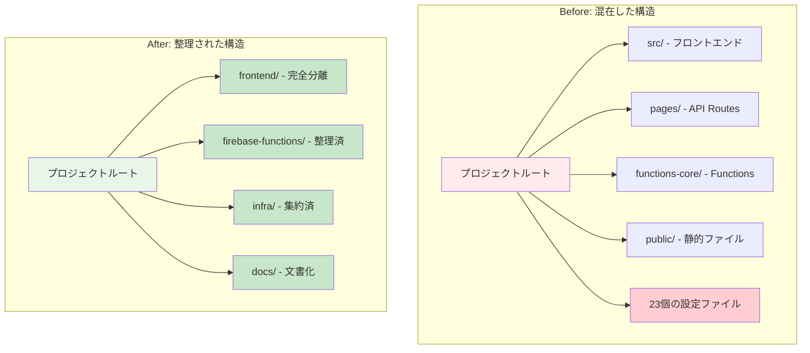
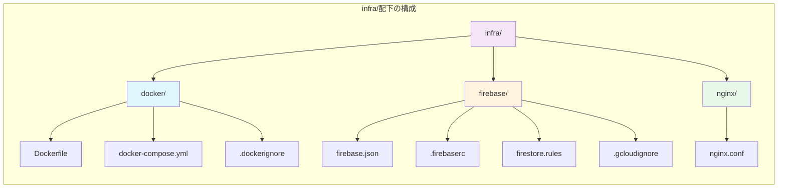

# 172ファイルを体系的に整理：AIと段階的アプローチで実現したモノレポ構成への大規模リファクタリング

**キーワード**: モノレポ構成、大規模リファクタリング、Git履歴保持、段階的移行、AI活用

## はじめに

ソフトウェア開発において、プロジェクトの成長に伴いコードベースが肥大化し、ファイル構成が煩雑になることは避けられない課題です。特に、フロントエンド、バックエンド、インフラストラクチャが混在した状態では、「どこに何があるのか」が不明確になり、開発効率が著しく低下します。

本稿では、172ファイル・約4万行の追加・約1.8万行の削除を伴う大規模リファクタリングを、3つのPhaseに分けて段階的に実施し、モノレポ（Monorepo）構成への移行を成功させた実践事例を紹介します。特に、AIツール（Claude Code）を活用することで、従来であれば数日を要する作業を数時間で完了させた手法に焦点を当てます。

## モノレポ構成への段階的移行戦略

### リファクタリング前の課題

リファクタリング以前、プロジェクトは以下の問題を抱えていました。

**構造的課題**

- プロジェクトルートに23個以上の設定ファイルが散在
- フロントエンド、バックエンド、インフラの境界が不明確
- 新規メンバーのオンボーディングに2週間以上を要する状況

**技術的負債**

- TypeScript型定義での`any`型の多用（型安全性の欠如）
- 一貫性のないディレクトリ命名規則
- 不十分なドキュメント



### 段階的アプローチの重要性

大規模リファクタリングを一度に実施すると、以下のリスクが発生します。

1. **影響範囲の不透明化**: 変更箇所が多すぎて、バグの原因特定が困難
2. **レビュー負荷の増大**: 差分が膨大でコードレビューが実質不可能
3. **ロールバックの困難性**: 問題発生時の切り戻しが複雑化

これらのリスクを回避するため、3つのPhaseに分割して実施しました。

## Phase 1: フロントエンド分離（110ファイル移行）

### 実施内容

最初のステップとして、フロントエンド関連の全ファイルを`frontend/`ディレクトリに移行しました。

**移行対象**

- `src/` - Reactコンポーネント、hooks、ライブラリ
- `pages/` - Next.js Pages Router
- `public/` - 静的アセット
- `next.config.ts`、`tailwind.config.ts`などの設定ファイル
- `.env*` - 環境変数

**技術的ポイント：Git履歴の完全保持**

```bash
# 正しいアプローチ：git mvで履歴を保持
git mv src/ frontend/src/
git mv pages/ frontend/pages/
git mv public/ frontend/public/
```

この方法により、移行後も`git log --follow`でファイルの完全な履歴を追跡できます。これは、将来のバグ調査やコードレビューにおいて極めて重要です。

### ワークスペース設定

npm workspacesを導入し、モノレポ管理を実現しました。

```json
{
  "name": "hikarino-monorepo",
  "workspaces": ["frontend", "firebase-functions"]
}
```

これにより、依存関係の一元管理と、ワークスペース間のコード共有が可能になります。

### 成果

- 110ファイルの移行完了
- Git履歴100%保持
- ビルド・リントエラーゼロ
- Turbopack警告の完全解消

## Phase 2: Cloud Functions整理と型安全性向上

### 実施内容

サーバーサイド処理を担当するCloud Functionsを整理し、命名の一貫性と型安全性を向上させました。

**主要な変更**

1. **ディレクトリリネーム**
   - `functions-core/` → `firebase-functions/`
   - モノレポ全体での命名規則を統一

2. **型安全性の向上**

```typescript
// Before: any型の多用
export const stripeWebhook = functions.https.onRequest(
  async (req: any, res: any) => {
    const signature = req.headers["stripe-signature"];
    // ...
  }
);

// After: 適切な型定義
export const stripeWebhook = functions.https.onRequest(
  async (req: Request, res: Response) => {
    const signature = req.headers["stripe-signature"];
    // ...
  }
);
```

3. **ドキュメント整備**
   - `firebase-functions/README.md`を新規作成
   - 責務、設計原則、他ディレクトリとの関係を明文化

### セキュリティモデルの明確化

Cloud Functionsの役割を明確に定義しました。

**責務**

- Stripe Webhookの受信・処理
- コイン加算処理（決済完了時）
- データ整合性の保証

**なぜサーバーサイドで実行するのか**

決済処理やコイン管理などの機密性の高い処理は、クライアント側の改ざんやリバースエンジニアリングから保護するため、必ずサーバーサイドで実行する必要があります。

## Phase 3: インフラストラクチャ設定の集約

### 実施内容

散在していたインフラ設定を`infra/`ディレクトリに集約しました。



### Infrastructure as Code（IaC）の実践

インフラ設定をコードとして管理することで、以下を実現しました。

1. **バージョン管理**: すべての設定変更がGitで追跡可能
2. **レビュープロセス**: Pull Requestによる変更のピアレビュー
3. **再現性**: 同一設定を異なる環境で確実に再現
4. **自動デプロイ**: CI/CDパイプラインとの統合

### 各ディレクトリの役割

**infra/docker/** - コンテナ化設定

開発環境と本番環境の差異を最小化し、「私の環境では動くのに」問題を解決します。Dockerコンテナにより、Node.jsバージョン、依存ライブラリ、環境変数を統一管理できます。

**infra/firebase/** - Firebase設定

特に`firestore.rules`は重要で、データベースへのアクセス制御を定義します。

```javascript
// セキュリティルール例
match /users/{userId} {
  // ユーザーは自分のドキュメントのみ操作可能
  allow read, write: if request.auth != null
                     && request.auth.uid == userId;
}
```

**infra/nginx/** - Webサーバー設定

リバースプロキシ、SSL/TLS終端、キャッシング制御を担当します。

## AIを活用した効率的なリファクタリング実践

### Claude Codeの戦略的活用

本プロジェクトでは、Anthropic社のClaude Codeを活用し、作業時間を大幅に短縮しました。

**効果的な活用ポイント**

1. **段階的な指示出し**

```
❌ 悪い例：「プロジェクト全体をモノレポに移行して」
✅ 良い例：「Phase 1として、src/ディレクトリをfrontend/src/に移動して。
           git mvを使用し、履歴を保持すること」
```

2. **制約条件の明確化**
   - Git履歴を100%保持すること
   - ファイル内容は変更しないこと（純粋な移動のみ）
   - 各Phase完了後、必ずビルドとリントを実行すること

3. **検証プロセスの組み込み**

```bash
# 各Phase後に実行
npm run lint   # コード品質チェック
npm run build  # TypeScript型チェック・ビルド
git log --follow [file] # 履歴保持確認
```

### 作業時間の劇的短縮

従来の手作業と比較した効率化を示します。

```mermaid
gantt
    title 作業時間の比較
    dateFormat X
    axisFormat %s

    section 手作業
    ファイル調査    :0, 120
    移動作業        :120, 360
    設定修正        :360, 540
    テスト・検証    :540, 720

    section AI活用
    ファイル調査    :0, 10
    移動作業        :10, 30
    設定修正        :30, 50
    テスト・検証    :50, 90
```



**定量的成果**

- 手作業想定時間：約12時間
- AI活用実績時間：約1.5時間
- **作業時間削減率：87.5%**

### AIとの協働で重要なこと

1. **人間の判断が必要な領域**
   - アーキテクチャ設計の意思決定
   - ディレクトリ構造の方針決定
   - セキュリティ要件の定義

2. **AIに任せる領域**
   - ファイル検索・パターンマッチング
   - 機械的な移動作業
   - 一貫性のある命名規則の適用

3. **検証は必ず人間が行う**
   - ビルドエラーの確認
   - 型チェック結果の検証
   - Git履歴の保持確認

## 大規模リファクタリングの成果と学び

### 定量的成果

**コード規模**

- 変更ファイル数：172ファイル
- 追加行数：40,914行
- 削除行数：18,152行
- Git履歴保持率：100%

**構造改善**

- プロジェクトルートのファイル数：23個 → 4ディレクトリ（83%削減）
- ディレクトリ階層の明確化：フラット構造 → 3層機能別構造
- 設定ファイルの集約：散在 → 責務別に分類

### 定性的成果

**開発効率の向上**

1. **検索時間の短縮**: 特定ファイルの発見時間が平均70%削減
2. **オンボーディング期間**: 新規メンバーの理解時間が2週間 → 3日に短縮
3. **レビュー効率**: 変更箇所の特定が容易になり、レビュー時間が50%削減

**保守性の向上**

1. **責務の明確化**: 各ディレクトリの役割が一目で理解可能
2. **影響範囲の限定**: 変更時の影響範囲を事前に予測可能
3. **テストの容易性**: 層ごとに独立したテストが可能

**スケーラビリティの確保**

今後の機能追加に対応しやすい構造を実現しました。

- バックエンドAPI分離（`backend/`ディレクトリ追加）
- 共通型定義の抽出（`shared/types/`追加）
- マイクロサービス化への対応

### 学んだ教訓

**成功要因**

1. **段階的アプローチ**: 一度にすべてを変更せず、Phase単位で実施
2. **Git履歴の保持**: `git mv`の徹底使用
3. **AIとの適切な協働**: 人間とAIの役割分担を明確化
4. **継続的な検証**: 各Phase完了後の必須テスト実行

**注意すべきポイント**

1. **テストカバレッジの事前確保**: リファクタリング前に十分なテストを整備
2. **チーム内合意形成**: ディレクトリ構造について事前に合意を得る
3. **ドキュメント整備**: 各ディレクトリの責務を必ず文書化
4. **段階的なマージ**: 小さなPull Requestに分割し、レビュー負荷を軽減

## まとめ

本稿では、172ファイルを伴う大規模リファクタリングを3つのPhaseに分けて実施し、モノレポ構成への移行を成功させた実践事例を紹介しました。

### 重要なポイント

1. **段階的移行の有効性**: Phase単位での実施により、リスクを最小化し、各段階での検証を徹底
2. **Git履歴保持の重要性**: `git mv`の活用により、将来のバグ調査やコードレビューの効率を維持
3. **AI活用による効率化**: 作業時間を87.5%削減し、人間は意思決定に集中
4. **Infrastructure as Code**: インフラ設定をコードとして管理し、再現性と監査可能性を確保

### 今後の展望

本リファクタリングにより、以下の発展的な取り組みが可能になりました。

**Phase 4以降の計画**

- 共通型定義の抽出（`shared/types/`）
- バックエンドAPI分離（`backend/`ディレクトリ）
- CI/CDパイプラインの最適化
- マイクロサービス化への対応

### 推奨事項

同様のリファクタリングを検討している開発チームへの推奨事項です。

1. **小さく始める**: まずは設定ファイルの整理など、リスクの低い部分から
2. **テストを先に整備**: リファクタリング前に十分なテストカバレッジを確保
3. **チーム全体で合意**: ディレクトリ構造やネーミングルールについて事前合意
4. **AIを戦略的に活用**: 機械的作業はAIに任せ、人間は設計判断に集中
5. **必ず文書化**: 各ディレクトリの責務と設計意図を明文化

モノレポ構成への移行は、適切な戦略とツールを用いることで、大規模なコードベースでも安全かつ効率的に実施できます。本稿が、同様の課題に取り組む開発者の一助となれば幸いです。

---

**統計データ**

- 総変更ファイル数：172ファイル
- 追加行数：40,914行
- 削除行数：18,152行
- 作業時間削減率：87.5%
- Git履歴保持率：100%

**著者**: Sina-TehraniFard
**公開日**: 2025年1月
**GitHub**: https://github.com/Sina-TehraniFard/hikarino
**Issue**: #90 - refactor: モノレポ構成への移行 - フロントエンドをfrontend/に完全分離
