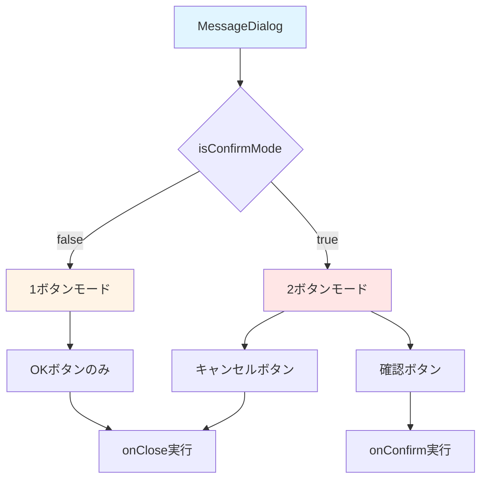
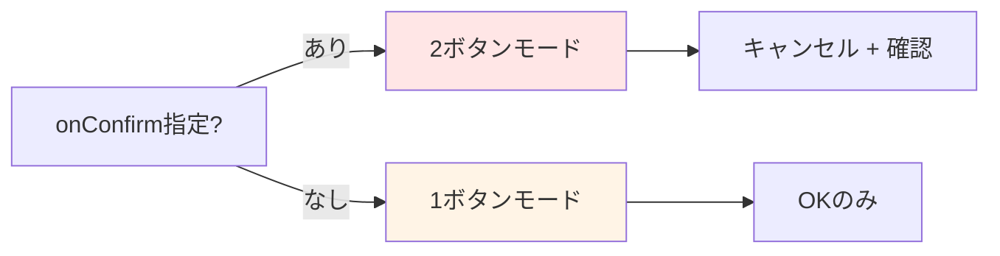
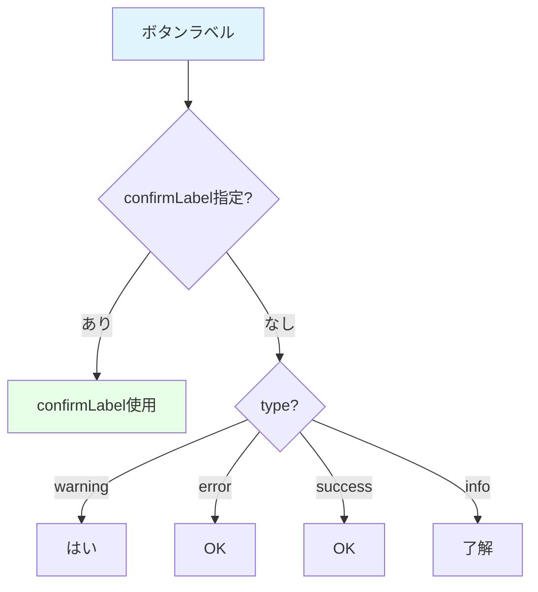

# MessageDialog コンポーネント

汎用的なメッセージダイアログコンポーネント。情報表示と確認ダイアログの両方に対応。

## ファイルパス

```
frontend/src/components/ui/MessageDialog.tsx
```

## 機能

- **1ボタンモード**: 情報表示（OK/了解ボタンのみ）
- **2ボタンモード**: 確認ダイアログ（キャンセル/確認ボタン）
- **4種類のタイプ**: info, warning, error, success
- **ローディング状態**: ボタン無効化と「処理中...」表示

## プロパティ

| プロパティ     | 型                                          | 必須 | デフォルト     | 説明                                              |
| -------------- | ------------------------------------------- | ---- | -------------- | ------------------------------------------------- |
| `isOpen`       | boolean                                     | ✓    | -              | ダイアログの表示状態                              |
| `onClose`      | () => void                                  | ✓    | -              | 閉じる時のコールバック                            |
| `message`      | string                                      | ✓    | -              | 表示するメッセージ                                |
| `title`        | string                                      | -    | typeに応じた値 | ダイアログのタイトル                              |
| `type`         | "info" \| "warning" \| "error" \| "success" | -    | "info"         | ダイアログのタイプ                                |
| `onConfirm`    | () => void                                  | -    | -              | 確認ボタンのコールバック（指定時は2ボタンモード） |
| `confirmLabel` | string                                      | -    | typeに応じた値 | 確認ボタンのラベル                                |
| `cancelLabel`  | string                                      | -    | "キャンセル"   | キャンセルボタンのラベル                          |
| `isLoading`    | boolean                                     | -    | false          | ローディング状態                                  |

## タイプ別のスタイル

| type    | アイコン | 色  | デフォルトタイトル | デフォルトボタンラベル |
| ------- | -------- | --- | ------------------ | ---------------------- |
| info    | 💭       | 青  | お知らせ           | 了解                   |
| warning | ⚠️       | 黄  | 注意               | はい                   |
| error   | ❌       | 赤  | エラー             | OK                     |
| success | ✅       | 緑  | 成功               | OK                     |

## 使用例

### 1ボタンモード（情報表示）

```tsx
<MessageDialog
  isOpen={true}
  onClose={() => setShowDialog(false)}
  type="error"
  message="エラーが発生しました"
/>
```

### 2ボタンモード（確認ダイアログ）

```tsx
<MessageDialog
  isOpen={true}
  onClose={() => setShowDialog(false)}
  onConfirm={() => handleDelete()}
  type="warning"
  title="削除確認"
  message="本当に削除しますか？"
  confirmLabel="削除する"
  cancelLabel="キャンセル"
  isLoading={isDeleting}
/>
```

## コンポーネント構造



## モード判定ロジック



## ボタンラベルの決定



## 実装における注意点

### 後方互換性

既存の1ボタンモードの使用箇所は変更不要。`onConfirm`を指定しない限り従来通りの動作。

### ローディング状態

`isLoading={true}`の場合：

- 両方のボタンが無効化
- 確認ボタンのラベルが「処理中...」に変更
- `disabled:opacity-50 disabled:cursor-not-allowed`スタイル適用

### z-index

`z-50`で他のUIより前面に表示。

## 関連コンポーネント

- **LoginModal**: ログインUI専用
- **CoinPurchaseModal**: コイン購入専用
- **NameSetupModal**: 名前設定専用
- **TermsAgreementModal**: 利用規約同意専用

上記は特定用途のモーダル。汎用的な確認・メッセージ表示はMessageDialogを使用。
