# OpenAI APIモデル比較調査報告書

**調査日**: 2025年10月25日
**対象モデル**: GPT-5, GPT-4o, GPT-4
**目的**: Issue #86対応 - GPT-5への移行検討

---

## エグゼクティブサマリー

OpenAIは2025年8月にGPT-5をリリースし、推論能力の大幅な向上とコスト削減を実現しました。GPT-4oと比較して**入力コストが半分**、GPT-4と比較して**約96%のコスト削減**を達成しています。

### 主な推奨事項

1. **即時移行推奨**: GPT-4からGPT-5への移行で大幅なコスト削減とパフォーマンス向上
2. **段階的移行**: GPT-4o使用中の場合も、GPT-5への移行でさらなるコスト削減が可能
3. **モデル選択**: 通常用途は`gpt-5`、高速応答が必要な場合は`gpt-5-mini`を推奨

---

## モデル進化のタイムライン

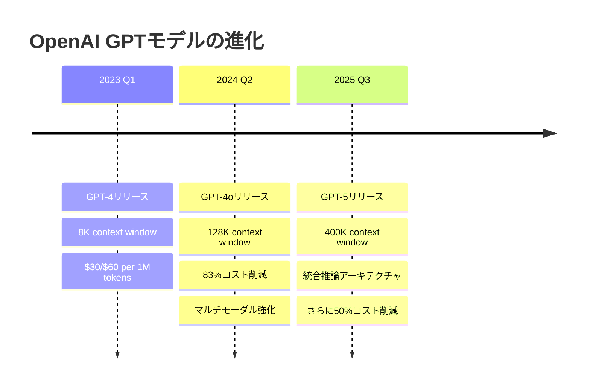

---

## 詳細スペック比較表

| 項目                   | GPT-5                                | GPT-4o                  | GPT-4                    |
| ---------------------- | ------------------------------------ | ----------------------- | ------------------------ |
| **リリース日**         | 2025年8月                            | 2024年5月               | 2023年3月                |
| **入力料金**           | $1.25/1M tokens                      | $2.50/1M tokens         | $30/1M tokens            |
| **出力料金**           | $10/1M tokens                        | $10/1M tokens           | $60/1M tokens            |
| **コンテキスト長**     | 400K tokens (API: 272K入力+128K出力) | 128K tokens             | 8K tokens                |
| **最大出力トークン**   | 128,000 tokens                       | 16,384 tokens           | 4,096 tokens             |
| **マルチモーダル**     | ✅ テキスト、コード、画像            | ✅ テキスト、画像       | ✅ テキストのみ (初期版) |
| **推論機能**           | ✅ 統合推論制御                      | ❌                      | ❌                       |
| **APIモデル名**        | `gpt-5`, `gpt-5-mini`, `gpt-5-nano`  | `gpt-4o`, `gpt-4o-mini` | `gpt-4`, `gpt-4-turbo`   |
| **ナレッジカットオフ** | 2025年6月                            | 2023年10月              | 2021年9月                |

---

## 価格比較（100万トークンあたり）

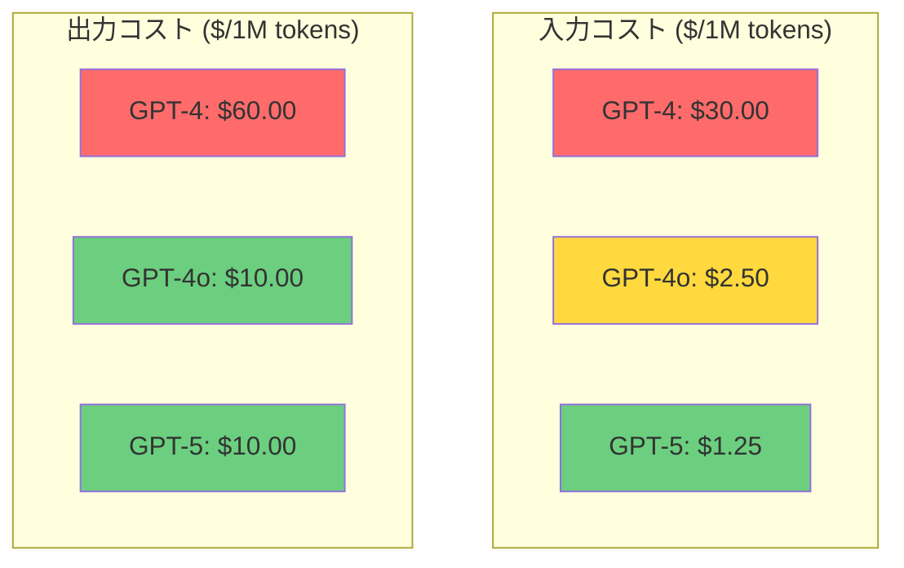

### コスト削減率

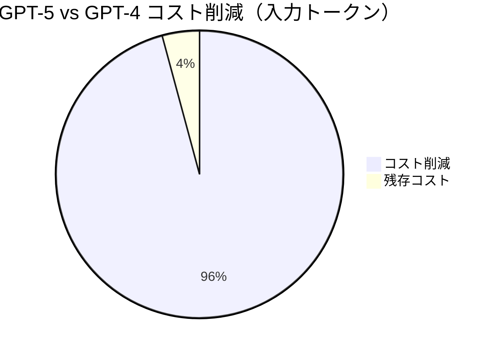

---

## コンテキストウィンドウ比較

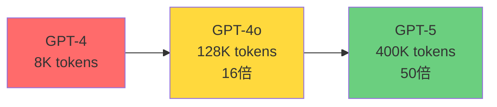

---

## パフォーマンスベンチマーク

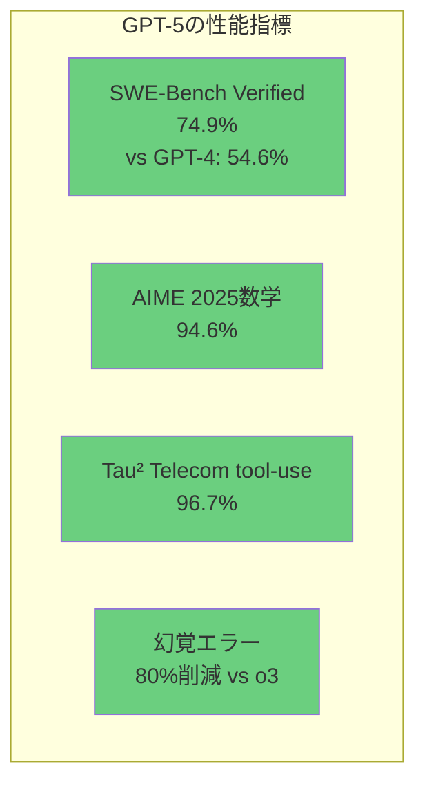

### 主要ベンチマーク比較

| ベンチマーク       | GPT-5      | GPT-4o | GPT-4 | 改善率 |
| ------------------ | ---------- | ------ | ----- | ------ |
| SWE-Bench Verified | 74.9%      | -      | 54.6% | +37%   |
| AIME 2025 (数学)   | 94.6%      | -      | -     | -      |
| Tau² Telecom       | 96.7%      | -      | -     | -      |
| 幻覚削減           | -80% vs o3 | -      | -     | -      |

---

## 機能マトリックス

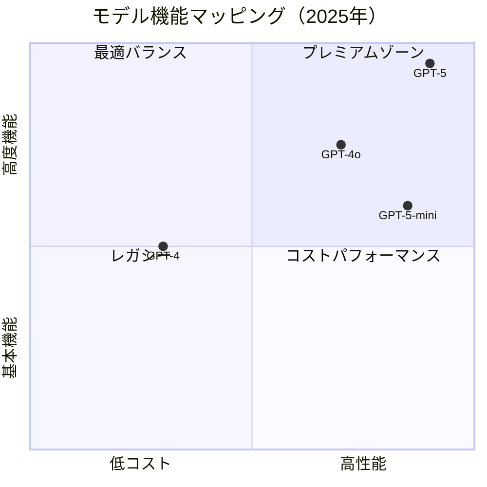

---

## GPT-5の主要新機能

### 1. 統合推論アーキテクチャ

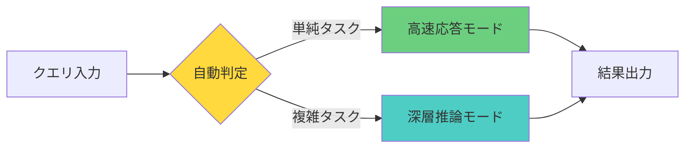

### 2. 詳細度制御（Verbosity Parameter）

- `low`: 簡潔な回答
- `medium`: 標準的な詳細度
- `high`: 包括的で詳細な回答

### 3. 推論努力制御（Reasoning Effort Parameter）

- `minimal`: 最速応答（軽量推論）
- `standard`: 通常推論
- `high`: 深層推論

---

## API使用例

### GPT-4からGPT-5への移行

**変更前 (GPT-4)**

```typescript
const response = await openai.chat.completions.create({
  model: "gpt-4",
  messages: [{ role: "user", content: "こんにちは" }],
  max_tokens: 1000,
});
```

**変更後 (GPT-5)**

```typescript
const response = await openai.chat.completions.create({
  model: "gpt-5", // モデル名のみ変更
  messages: [{ role: "user", content: "こんにちは" }],
  max_tokens: 1000,
  // オプション: 新機能の活用
  verbosity: "medium", // 詳細度制御
  reasoning_effort: "standard", // 推論努力制御
});
```

---

## 移行時の互換性評価

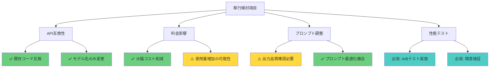

### 互換性チェックリスト

| 項目               | 状態      | 詳細                       |
| ------------------ | --------- | -------------------------- |
| APIエンドポイント  | ✅ 互換   | 同一エンドポイント使用可能 |
| リクエスト形式     | ✅ 互換   | 既存コード動作             |
| レスポンス形式     | ✅ 互換   | パース処理変更不要         |
| トークン計算       | ⚠️ 要確認 | 同一トークナイザー使用     |
| 出力品質           | ⚠️ 要検証 | A/Bテスト推奨              |
| エラーハンドリング | ✅ 互換   | 既存処理継続可能           |

---

## コスト試算

### 想定利用シナリオ

| シナリオ                       | 月間トークン数 | GPT-4コスト | GPT-4oコスト | GPT-5コスト | 削減額       |
| ------------------------------ | -------------- | ----------- | ------------ | ----------- | ------------ |
| **小規模** (10M入力/5M出力)    | 15M            | $600        | $85          | $62.5       | **$537.5**   |
| **中規模** (50M入力/25M出力)   | 75M            | $3,000      | $425         | $312.5      | **$2,687.5** |
| **大規模** (200M入力/100M出力) | 300M           | $12,000     | $1,700       | $1,250      | **$10,750**  |

```mermaid
bar chart
    title 月額コスト比較（中規模利用）
    x-axis [GPT-4, GPT-4o, GPT-5]
    y-axis "コスト (USD)" 0 --> 3000
    bar [3000, 425, 312.5]
```

---

## リスク評価と対策

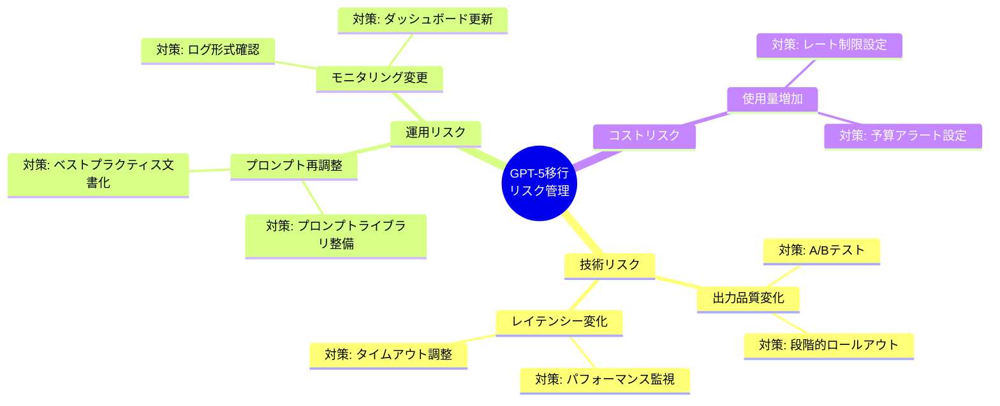

---

## 推奨移行ステップ

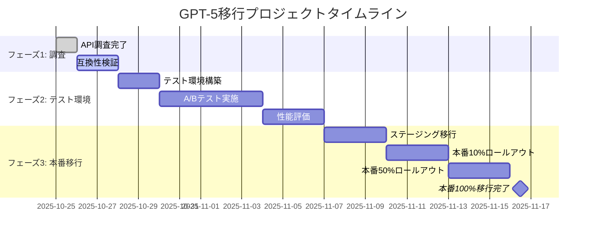

### ステップ詳細

1. **フェーズ1: 調査・検証** (3日間)
   - ✅ API仕様調査完了
   - ⏳ 既存コードベース互換性検証
   - ⏳ プロンプト影響評価

2. **フェーズ2: テスト環境構築** (10日間)
   - テスト環境でGPT-5導入
   - 既存GPT-4/4oとA/Bテスト
   - 出力品質・レイテンシー・コスト評価
   - プロンプト最適化

3. **フェーズ3: 段階的本番移行** (10日間)
   - ステージング環境で最終確認
   - カナリアリリース（10% → 50% → 100%）
   - モニタリング強化
   - ロールバック計画準備

---

## モニタリング指標

### 主要KPI

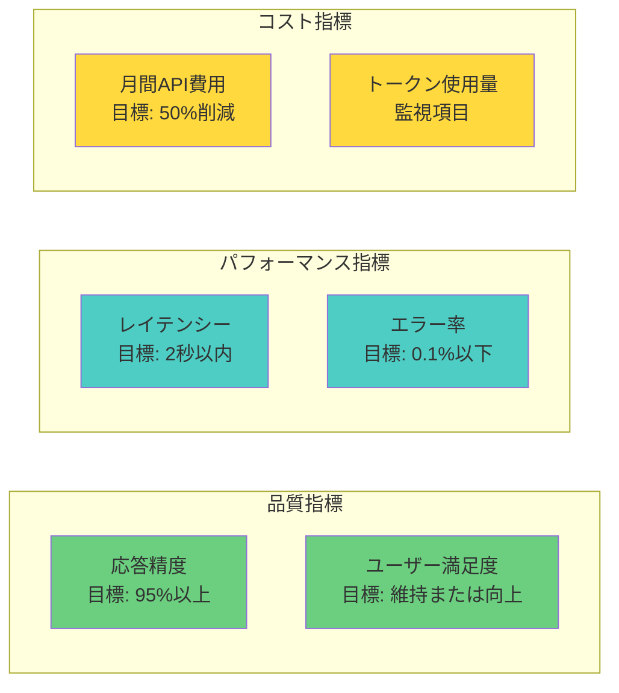

---

## 結論と次アクション

### 結論

1. **GPT-5は明確な優位性**: コスト、性能、機能すべてで前世代を上回る
2. **高い後方互換性**: 既存コードへの影響は最小限
3. **投資対効果が高い**: 移行コストに対して大幅なコスト削減とパフォーマンス向上

### 次アクション

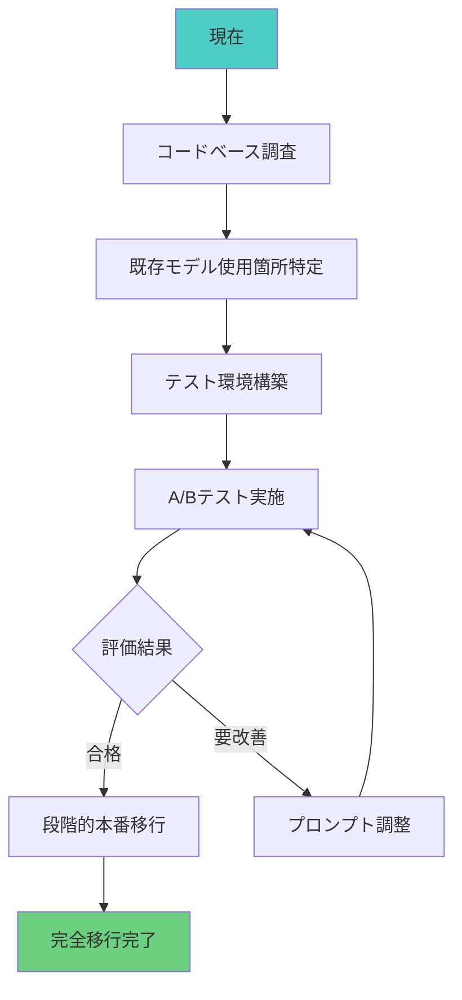

#### 即時対応項目

1. ✅ **調査完了**: GPT-5 API仕様調査
2. ⏳ **コードベース分析**: 既存OpenAI API使用箇所の特定
3. ⏳ **テスト計画策定**: A/Bテスト環境とシナリオ設計
4. ⏳ **予算承認**: コスト削減見込みの報告と承認取得

---

## 参考資料

### 公式ドキュメント

- [OpenAI API Pricing](https://openai.com/api/pricing/)
- [GPT-5 Developer Documentation](https://platform.openai.com/docs/models/gpt-5)
- [GPT-4o Model Card](https://platform.openai.com/docs/models/gpt-4o)

### 調査ソース

- LeanWare: GPT-5 Features Guide
- AIMultiple: GPT-5 Research
- InfoQ: OpenAI GPT-5 Release Analysis
- Simon Willison: GPT-5 Technical Analysis
- DigitalOcean: GPT-5 Overview

---

**作成者**: 調査担当
**最終更新**: 2025年10月25日
**関連Issue**: #86 - OpenAIのAPIで使用しているAIモデルの変更
