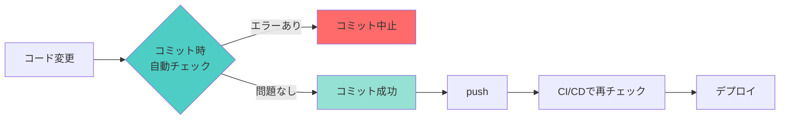
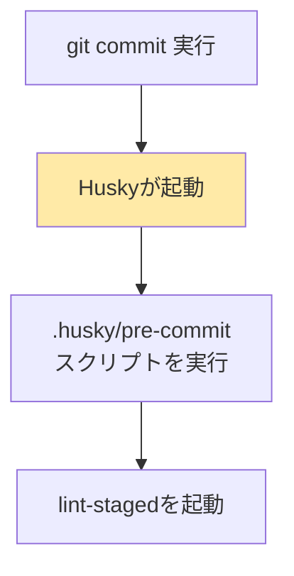
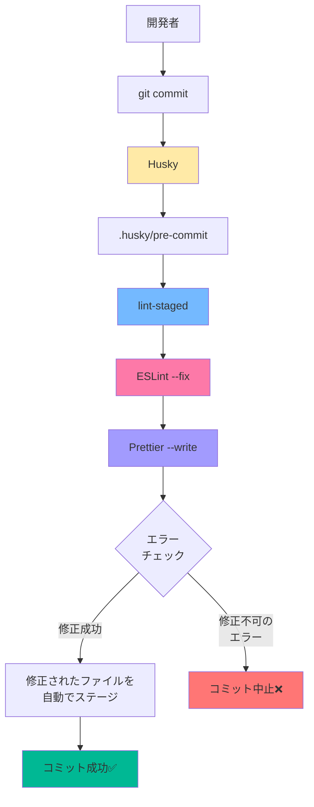
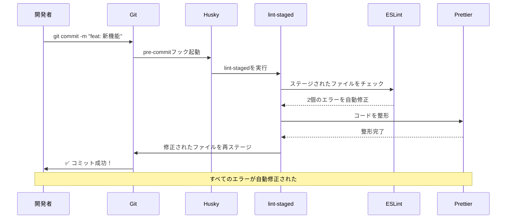
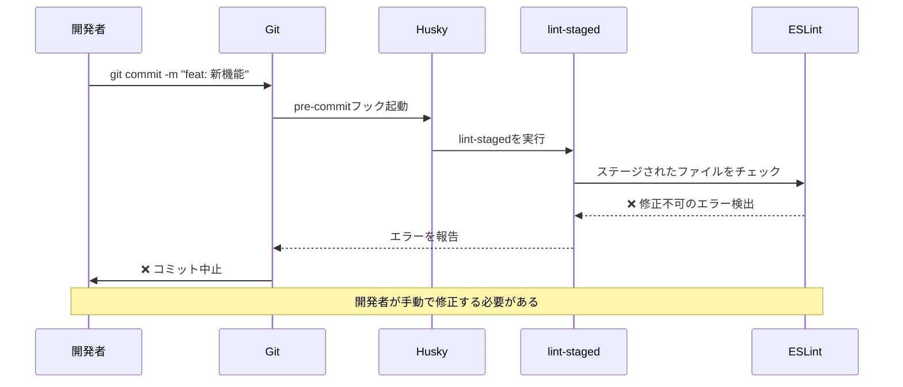

# コミット前自動チェック・自動修正の仕組み

## 📋 目次

1. [はじめに](#はじめに)
2. [なぜこの仕組みが必要なのか](#なぜこの仕組みが必要なのか)
3. [導入したツールの説明](#導入したツールの説明)
4. [全体の仕組み](#全体の仕組み)
5. [セットアップ内容](#セットアップ内容)
6. [動作フロー](#動作フロー)
7. [使い方](#使い方)
8. [よくある質問](#よくある質問)
9. [トラブルシューティング](#トラブルシューティング)

---

## はじめに

このドキュメントでは、本プロジェクトに導入された「**コミット前の自動チェック・自動修正の仕組み**」について説明します。

### 解決したい問題

以前は以下のような問題がありました：

- ❌ コミット後にCIでエラーが発覚する
- ❌ 構文エラーでビルドが失敗する
- ❌ コードスタイルが統一されていない
- ❌ mainブランチへのpushで本番環境に問題が混入する

### 導入後の状態

この仕組みを導入することで：

- ✅ コミット前に自動的にコードをチェック
- ✅ 修正可能なエラーは自動で修正
- ✅ 修正できないエラーがあればコミットを中止
- ✅ CIで失敗することを事前に防止

---

## なぜこの仕組みが必要なのか

### 背景

本プロジェクトは以下のような構成になっています：


**問題点：** mainブランチへのpushが直接本番デプロイにつながるため、エラーがあると本番環境に影響が出てしまいます。

### 理想的な開発フロー



**コミット時点でエラーを検出**することで、問題を早期に発見・修正できます。

---

## 導入したツールの説明

### 1. Husky（ハスキー）🐕

**役割：** Git hooksを簡単に管理するツール

#### Git hooksとは？

Gitには「特定のタイミングで自動的にスクリプトを実行する仕組み」があります。これを**Git hooks**と呼びます。

例：

- `pre-commit`: コミットする直前
- `pre-push`: pushする直前
- `commit-msg`: コミットメッセージを書いた後

#### Huskyの役割

Gitのhooksを簡単に設定・共有できるようにします。



---

### 2. lint-staged（リント・ステージド）📝

**役割：** ステージングされたファイル（コミット対象のファイル）だけにLintを実行

#### なぜ必要？

プロジェクト全体をチェックすると時間がかかります。
lint-stagedは**変更したファイルだけ**をチェックするので高速です。


#### 設定例（package.json）

```json
"lint-staged": {
  "*.{js,jsx,ts,tsx}": [
    "eslint --fix",      // ESLintで自動修正
    "prettier --write"   // Prettierで整形
  ]
}
```

---

### 3. Prettier（プリティア）💅

**役割：** コードを自動整形するフォーマッター

#### 何をしてくれる？

コードのスタイルを統一します：

**Before:**

```typescript
function hello(name: string) {
  console.log("Hello," + name);
}
```

**After (Prettierで整形):**

```typescript
function hello(name: string) {
  console.log("Hello, " + name);
}
```

#### 設定ファイル（.prettierrc）

```json
{
  "semi": true, // セミコロンを付ける
  "singleQuote": false, // ダブルクォートを使う
  "printWidth": 80, // 1行の最大文字数
  "tabWidth": 2 // インデント幅
}
```

---

### 4. ESLint（イーエスリント）🔍

**役割：** JavaScriptやTypeScriptのコードをチェックするツール

#### 何をチェックする？

- 構文エラー
- バグの可能性がある書き方
- コーディング規約違反

#### 修正モード

`eslint --fix` を使うと、修正可能なエラーは自動で直してくれます。

```typescript
// エラー: 未使用の変数
const unused = 10; // ← ESLintが検出して削除

// エラー: console.logの残し忘れ
console.log("debug"); // ← 警告を出す
```

---

## 全体の仕組み

### ツールの関係性



---

## セットアップ内容

このプロジェクトには以下の設定が完了しています。

### 1. インストールされたパッケージ

```json
{
  "devDependencies": {
    "husky": "^9.1.7",
    "lint-staged": "^16.2.4",
    "prettier": "^3.6.2",
    "eslint-config-prettier": "^10.1.8"
  }
}
```

### 2. ファイル構成

```
hikarino/
├── .husky/
│   └── pre-commit              # コミット前に実行されるスクリプト
├── .prettierrc                 # Prettierの設定
├── eslint.config.mjs           # ESLintの設定
└── package.json                # lint-stagedの設定を含む
```

### 3. Huskyの設定（.husky/pre-commit）

```bash
npx lint-staged
```

このスクリプトが**コミット直前**に自動実行されます。

### 4. lint-stagedの設定（package.json）

```json
"lint-staged": {
  "*.{js,jsx,ts,tsx}": [
    "eslint --fix",
    "prettier --write"
  ],
  "*.{json,css,md}": [
    "prettier --write"
  ]
}
```

#### 設定の意味

- `*.{js,jsx,ts,tsx}`: TypeScript/JavaScriptファイルに対して
  1. ESLintで自動修正
  2. Prettierで整形

- `*.{json,css,md}`: その他のファイルに対して
  1. Prettierで整形

### 5. ESLintの設定（eslint.config.mjs）

```javascript
const eslintConfig = [
  ...compat.extends("next/core-web-vitals", "next/typescript"),
  ...compat.extends("prettier"), // ← Prettierとの競合を防止
];
```

`eslint-config-prettier` によって、ESLintとPrettierのルールが競合しないようになっています。

---

## 動作フロー

### ケース1: 修正可能なエラーがある場合



### ケース2: 修正できないエラーがある場合



---

## 使い方

### 基本的な使い方

**今まで通り**、普通にコミットするだけです！

```bash
# 1. ファイルをステージング
git add src/components/MyComponent.tsx

# 2. コミット（この時点で自動チェックが走る）
git commit -m "feat: 新しいコンポーネント追加"

# 実行結果:
# ✔ Preparing lint-staged...
# ✔ Running tasks for staged files...
# ✔ Applying modifications from tasks...
# ✔ Cleaning up temporary files...
# [main abc1234] feat: 新しいコンポーネント追加
```

### エラーが出た場合

```bash
git commit -m "fix: バグ修正"

# 実行結果:
# ✖ eslint --fix:
#   Error: 'unused' is assigned a value but never used
#
# ✖ lint-staged failed
```

このような場合は：

1. エラーメッセージを確認
2. 該当箇所を手動で修正
3. 再度 `git add` と `git commit`

---

## よくある質問

### Q1. コミットに時間がかかるようになった？

**A:** lint-stagedは変更されたファイルだけをチェックするため、通常は数秒で完了します。初回は少し時間がかかる場合があります。

### Q2. 自動修正を無効にしたい場合は？

**A:** 以下のコマンドで一時的にフックをスキップできます：

```bash
git commit --no-verify -m "一時的にチェックをスキップ"
```

⚠️ **注意:** 可能な限り使用しないでください。CIでエラーになる可能性があります。

### Q3. 既存のコード全体をフォーマットしたい

**A:** 以下のコマンドを実行してください：

```bash
# Prettierで全ファイルを整形
npm run format

# ESLintで全ファイルをチェック・修正
npm run lint -- --fix
```

（※ `format` スクリプトが未定義の場合は追加が必要です）

### Q4. チーム全員に適用される？

**A:** はい！リポジトリをクローンして `npm install` を実行すると、Huskyが自動的にセットアップされます。

```bash
git clone <repository>
cd hikarino
npm install  # ← ここでHuskyが有効化される
```

---

## トラブルシューティング

### 問題1: Huskyが動作しない

**症状:**

- コミット時にlint-stagedが実行されない

**解決方法:**

```bash
# Huskyの再インストール
npx husky install

# pre-commitフックの権限確認
ls -la .husky/pre-commit
# -rwxr-xr-x であればOK（実行権限がある）

# 実行権限がない場合
chmod +x .husky/pre-commit
```

### 問題2: lint-stagedが全ファイルをチェックしてしまう

**原因:**

- ファイルが正しくステージングされていない

**解決方法:**

```bash
# ステージング状態を確認
git status

# 特定のファイルだけをステージング
git add src/components/MyComponent.tsx

# コミット
git commit -m "feat: 更新"
```

### 問題3: Prettierのフォーマットが気に入らない

**解決方法:**

`.prettierrc` を編集してください：

```json
{
  "semi": false, // セミコロンを付けない
  "singleQuote": true, // シングルクォートを使う
  "printWidth": 100 // 1行100文字まで
}
```

変更後、既存ファイルに適用：

```bash
npx prettier --write "src/**/*.{ts,tsx}"
```

### 問題4: ESLintのエラーが多すぎる

**一時的な対処:**

特定のルールを無効化できます（eslint.config.mjs）：

```javascript
const eslintConfig = [
  ...compat.extends("next/core-web-vitals", "next/typescript"),
  {
    rules: {
      "no-console": "off", // console.logを許可
    },
  },
];
```

---

## 参考資料

- [Husky公式ドキュメント](https://typicode.github.io/husky/)
- [lint-staged公式ドキュメント](https://github.com/okonet/lint-staged)
- [Prettier公式ドキュメント](https://prettier.io/)
- [ESLint公式ドキュメント](https://eslint.org/)

---

## まとめ

この仕組みにより：

✅ **コミット前に自動チェック** → CIでのエラーを防止
✅ **自動修正** → 手動作業を削減
✅ **コードスタイル統一** → レビューの負担軽減
✅ **本番環境の品質向上** → エラーの混入を防止

普段通りコミットするだけで、これらのメリットが自動的に得られます！
