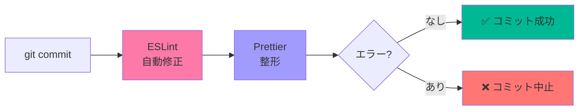

# クイックスタートガイド

新しくプロジェクトに参加したメンバー向けの簡易ガイドです。

## 🚀 すぐに始める

### 1. セットアップ（初回のみ）

```bash
# リポジトリをクローン
git clone https://github.com/Sina-TehraniFard/hikarino.git
cd hikarino

# 依存関係をインストール（Huskyも自動セットアップ）
npm install
```

✅ これだけで準備完了！

---

### 2. 普段の開発フロー

```bash
# コードを変更
vim src/components/MyComponent.tsx

# ステージング
git add src/components/MyComponent.tsx

# コミット（自動チェックが走る）
git commit -m "feat: 新機能追加"

# 出力例:
# ✔ Preparing lint-staged...
# ✔ Running tasks for staged files...
# ✔ Applying modifications from tasks...
# [main abc1234] feat: 新機能追加
```

**特別な操作は不要**です。いつも通りコミットするだけ！

---

## 💡 知っておくべきこと

### コミット時に何が起こる？



---

### エラーが出た場合

```bash
git commit -m "fix: バグ修正"

# 出力:
# ✖ eslint --fix:
#   Error: 'unused' is defined but never used
```

**対処法：**

1. エラーメッセージを読む
2. 該当箇所を修正
3. 再度 `git add` → `git commit`

---

## 📚 詳しく知りたい場合

- **詳細ガイド**: [README.md](./README.md)
- **トラブルシューティング**: [troubleshooting.md](./troubleshooting.md)

---

## ❓ よくある質問

### Q. コミットに時間がかかるようになった？

**A.** 変更されたファイルだけをチェックするので、通常は数秒です。初回は少し時間がかかることがあります。

---

### Q. チェックをスキップしたい

**A.** 緊急時のみ以下を使用：

```bash
git commit --no-verify -m "緊急修正"
```

⚠️ CIで失敗する可能性があるため、多用しないでください。

---

### Q. 既存のコード全体をフォーマットしたい

**A.** 以下のコマンドで一括整形：

```bash
# Prettierで全ファイルを整形
npx prettier --write "src/**/*.{ts,tsx,js,jsx,json,css,md}"

# ESLintで全ファイルをチェック・修正
npm run lint -- --fix
```

---

### Q. 動作確認したい

**A.** 以下のコマンドでテスト：

```bash
# ファイルをステージ
git add src/components/MyComponent.tsx

# lint-stagedを手動実行
npx lint-staged

# 出力:
# ✔ Preparing lint-staged...
# ✔ Running tasks for staged files...
```

---

## 🔧 トラブル時のチェックリスト

問題が発生した場合、以下を順番に試してください：

```bash
# 1. Node.jsのバージョン確認
node --version  # v20以上推奨

# 2. Huskyが有効か確認
ls -la .husky/pre-commit

# 3. 実行権限がない場合
chmod +x .husky/pre-commit

# 4. Huskyの再初期化
npx husky install

# 5. 依存関係の再インストール
rm -rf node_modules package-lock.json
npm install
```

それでも解決しない場合は [troubleshooting.md](./troubleshooting.md) を参照してください。

---

## 🎯 まとめ

✅ `npm install` で自動セットアップ完了
✅ いつも通り `git commit` するだけ
✅ エラーは自動修正 or コミット前に検出
✅ CIでの失敗を防止

**あとは普段通り開発するだけです！**
