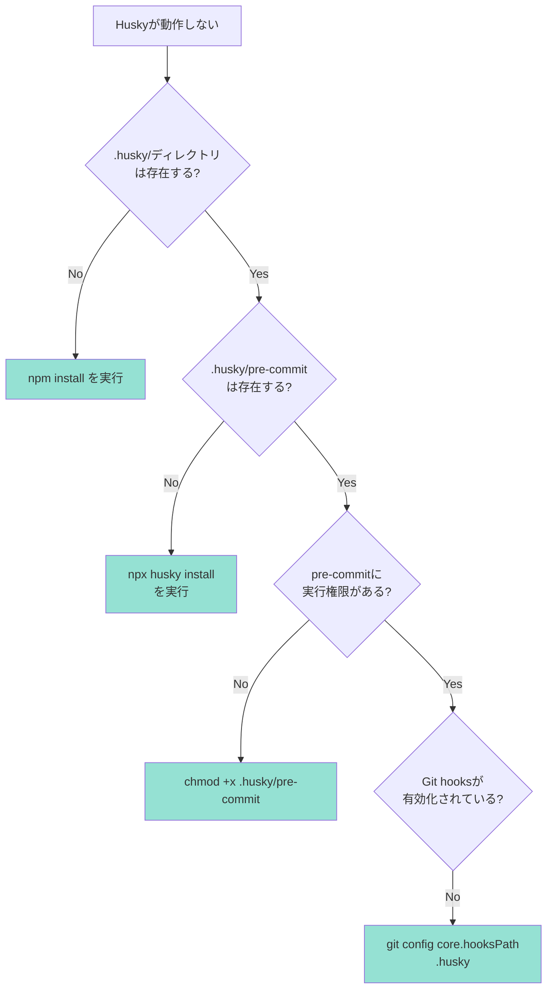
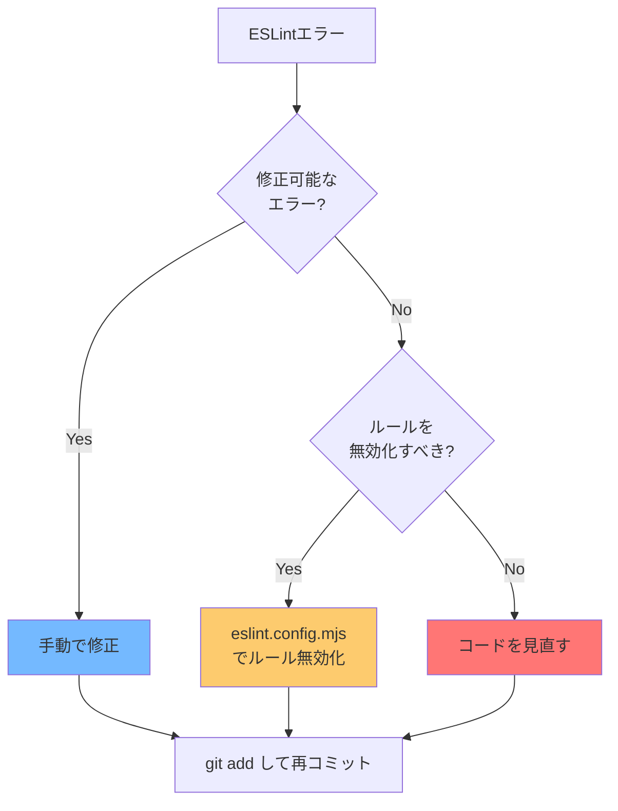
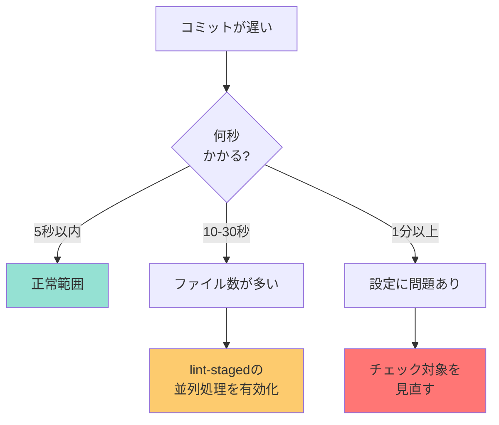

# トラブルシューティングガイド

このドキュメントでは、pre-commit設定に関する問題と解決方法を詳しく説明します。

## 📋 目次

1. [Huskyの問題](#huskyの問題)
2. [lint-stagedの問題](#lint-stagedの問題)
3. [ESLintの問題](#eslintの問題)
4. [Prettierの問題](#prettierの問題)
5. [パフォーマンスの問題](#パフォーマンスの問題)
6. [Git関連の問題](#git関連の問題)

---

## Huskyの問題

### 問題1: Huskyが全く動作しない

#### 症状

```bash
git commit -m "test"
[main abc1234] test  # ← lint-stagedが実行されない
```

#### 診断フロー



#### 解決方法

**ステップ1: Huskyの再インストール**

```bash
# package.jsonにprepareスクリプトがあることを確認
cat package.json | grep prepare
# 出力: "prepare": "husky"

# Huskyを初期化
npx husky install
```

**ステップ2: Git hooksのパス確認**

```bash
# 現在のhooksパスを確認
git config core.hooksPath

# 出力が「.husky」であればOK
# 何も表示されない場合は設定
git config core.hooksPath .husky
```

**ステップ3: 実行権限の確認**

```bash
# pre-commitの権限を確認
ls -la .husky/pre-commit

# 実行権限がない場合（-rw-r--r--）
chmod +x .husky/pre-commit

# 確認
ls -la .husky/pre-commit
# 出力: -rwxr-xr-x ... pre-commit
```

---

### 問題2: 「command not found: npx」エラー

#### 症状

```bash
.husky/pre-commit: line 1: npx: command not found
```

#### 原因

- Node.jsがインストールされていない
- PATHが正しく設定されていない

#### 解決方法

**ステップ1: Node.jsのインストール確認**

```bash
node --version
npm --version
npx --version
```

**ステップ2: PATHの設定（macOS/Linux）**

```bash
# .zshrc または .bashrc に追加
echo 'export PATH="/usr/local/bin:$PATH"' >> ~/.zshrc
source ~/.zshrc
```

**ステップ3: .husky/pre-commitの修正**

```bash
#!/usr/bin/env sh
. "$(dirname -- "$0")/_/husky.sh"

# Node.jsのパスを明示的に指定
export PATH="/usr/local/bin:$PATH"

npx lint-staged
```

---

## lint-stagedの問題

### 問題3: すべてのファイルがチェックされてしまう

#### 症状

```bash
git add src/components/MyComponent.tsx
git commit -m "feat: 更新"

# 実行結果:
# ✔ Running tasks for staged files...
# ✔ src/**/*.tsx — 50 files  ← 変更していないファイルもチェックされる
```

#### 原因

- Gitのステージング状態が正しくない
- lint-stagedの設定が間違っている

#### 解決方法

**ステップ1: ステージング状態の確認**

```bash
# ステージされているファイルを確認
git diff --cached --name-only

# 出力例:
# src/components/MyComponent.tsx
```

**ステップ2: 不要なファイルのアンステージ**

```bash
# すべてアンステージ
git reset

# 必要なファイルだけステージ
git add src/components/MyComponent.tsx

# 再度コミット
git commit -m "feat: 更新"
```

**ステップ3: lint-stagedの設定確認（package.json）**

```json
"lint-staged": {
  "*.{js,jsx,ts,tsx}": [
    "eslint --fix",
    "prettier --write"
  ]
}
```

---

### 問題4: 「No staged files match」エラー

#### 症状

```bash
git commit -m "test"

# 実行結果:
# ✔ Preparing lint-staged...
# ℹ No staged files match *.{js,jsx,ts,tsx}
```

#### 原因

- コミット対象のファイルがlint-stagedの設定にマッチしていない
- ファイルがステージされていない

#### 解決方法

```bash
# ステージされているファイルを確認
git status

# 出力例:
# Changes not staged for commit:
#   modified: README.md  ← ステージされていない

# ファイルをステージ
git add README.md

# 再度コミット
git commit -m "docs: READMEを更新"
```

---

## ESLintの問題

### 問題5: ESLintエラーでコミットできない

#### 症状

```bash
git commit -m "fix: バグ修正"

# 実行結果:
# ✖ eslint --fix:
#   src/components/MyComponent.tsx
#     12:7  error  'count' is assigned a value but never used  @typescript-eslint/no-unused-vars
#
# ✖ lint-staged failed
```

#### 診断フロー



#### 解決方法

**方法1: エラーを手動で修正**

```typescript
// エラー: 'count' is assigned a value but never used
const count = 10; // ← この行を削除

// または使用する
const count = 10;
console.log(count); // ← 使用箇所を追加
```

**方法2: 特定の行だけルールを無効化**

```typescript
// eslint-disable-next-line @typescript-eslint/no-unused-vars
const count = 10; // ← この行だけESLintの警告を無視
```

**方法3: プロジェクト全体でルールを無効化**

`eslint.config.mjs` を編集：

```javascript
const eslintConfig = [
  ...compat.extends("next/core-web-vitals", "next/typescript"),
  ...compat.extends("prettier"),
  {
    rules: {
      "@typescript-eslint/no-unused-vars": "warn", // errorからwarnに変更
      "no-console": "off", // console.logを許可
    },
  },
];
```

---

### 問題6: ESLintの処理が遅い

#### 原因

- 大量のファイルをチェックしている
- 不要なファイルがチェック対象に含まれている

#### 解決方法

**ステップ1: .eslintignore ファイルを作成**

```bash
# プロジェクトルートに作成
touch .eslintignore
```

`.eslintignore` の内容：

```
node_modules/
.next/
out/
build/
dist/
*.config.js
*.config.mjs
public/
```

**ステップ2: lint-stagedの設定を調整**

```json
"lint-staged": {
  "src/**/*.{js,jsx,ts,tsx}": [  // srcディレクトリに限定
    "eslint --fix",
    "prettier --write"
  ]
}
```

---

## Prettierの問題

### 問題7: Prettierのフォーマットが気に入らない

#### 例: セミコロンが付いてしまう

```typescript
// 元のコード
const message = "Hello";

// Prettier実行後
const message = "Hello"; // ← セミコロンが付く
```

#### 解決方法

`.prettierrc` を編集：

```json
{
  "semi": false, // セミコロンを付けない
  "singleQuote": true, // シングルクォートを使う
  "trailingComma": "none", // 末尾のカンマを付けない
  "printWidth": 100, // 1行100文字まで
  "tabWidth": 2, // インデント2スペース
  "useTabs": false, // タブではなくスペースを使う
  "arrowParens": "avoid" // アロー関数の引数の括弧を省略
}
```

**変更を既存ファイルに適用：**

```bash
# 全TypeScriptファイルを再フォーマット
npx prettier --write "src/**/*.{ts,tsx}"

# 確認
git diff
```

---

### 問題8: PrettierとESLintの設定が競合する

#### 症状

```bash
# Prettierで整形
npx prettier --write src/MyComponent.tsx

# ESLintを実行
npm run lint
# Error: Unexpected space before function parentheses
```

#### 解決方法

**eslint-config-prettierが正しく設定されているか確認：**

`eslint.config.mjs`:

```javascript
const eslintConfig = [
  ...compat.extends("next/core-web-vitals", "next/typescript"),
  ...compat.extends("prettier"), // ← これが最後に来ること！
];
```

**重要:** `prettier` の設定は**最後**に配置してください。

---

## パフォーマンスの問題

### 問題9: コミットに時間がかかる

#### 診断



#### 解決方法

**方法1: lint-stagedの並列処理を有効化**

`package.json` に追加：

```json
"lint-staged": {
  "*.{js,jsx,ts,tsx}": [
    "eslint --fix --max-warnings=0",
    "prettier --write"
  ],
  "concurrent": true  // ← 並列処理を有効化
}
```

**方法2: チェック対象を限定**

```json
"lint-staged": {
  "src/**/*.{ts,tsx}": [  // testやconfigファイルを除外
    "eslint --fix",
    "prettier --write"
  ]
}
```

---

## Git関連の問題

### 問題10: 「husky - pre-commit hook exited with code 1」

#### 症状

```bash
git commit -m "test"

# 実行結果:
# husky - pre-commit hook exited with code 1
# (use "--no-verify" to bypass)
```

#### 原因

- lint-stagedでエラーが発生している

#### 診断方法

```bash
# lint-stagedを直接実行して詳細を確認
npx lint-staged --debug

# 出力例:
# Running tasks for staged files...
# ✖ eslint --fix:
#   Error: src/MyComponent.tsx has errors
```

#### 解決方法

**ステップ1: エラー内容を確認**

```bash
# ESLintを直接実行
npm run lint

# 出力されたエラーを修正
```

**ステップ2: 一時的にスキップ（非推奨）**

```bash
# 緊急時のみ使用
git commit --no-verify -m "緊急修正"
```

⚠️ **警告:** `--no-verify` を使うとCIでエラーになる可能性があります。

---

### 問題11: コミットメッセージが途中で止まる

#### 症状

```bash
git commit
# エディタが開く
# メッセージを入力して保存
# ← ここでフリーズしたように見える
```

#### 原因

- lint-stagedが実行中（待機が必要）

#### 解決方法

**そのまま待つ** → 数秒〜数十秒で完了します。

進行状況を確認したい場合：

```bash
# 別のターミナルで確認
ps aux | grep lint-staged

# 実行中のプロセスが表示される
```

---

### 問題12: ステージされたファイルが勝手に変更される

#### 症状

```bash
git add src/MyComponent.tsx
git commit -m "feat: 更新"

# コミット後に確認
git status
# 出力:
# Changes not staged for commit:
#   modified: src/MyComponent.tsx
```

#### 原因

- lint-stagedがファイルを修正したが、一部の変更が残っている

#### 解決方法

```bash
# 修正内容を確認
git diff src/MyComponent.tsx

# 問題なければ追加でコミット
git add src/MyComponent.tsx
git commit --amend --no-edit

# または新しいコミットとして追加
git commit -m "style: lint自動修正"
```

---

## 緊急時の対処法

### すぐにコミットしたい（チェックをスキップ）

```bash
git commit --no-verify -m "緊急修正"
```

⚠️ **使用は最小限に！** CIでエラーになる可能性が高いです。

---

### Huskyを完全に無効化（非推奨）

```bash
# Git hooksを無効化
git config core.hooksPath /dev/null

# 元に戻す
git config core.hooksPath .husky
```

---

## デバッグコマンド一覧

### Huskyの確認

```bash
# Huskyのバージョン
npx husky --version

# Git hooksパスの確認
git config core.hooksPath

# pre-commitの内容確認
cat .husky/pre-commit
```

### lint-stagedの確認

```bash
# ステージされたファイルを確認
git diff --cached --name-only

# lint-stagedをデバッグモードで実行
npx lint-staged --debug

# dry-runで実行（実際には変更しない）
npx lint-staged --dry-run
```

### ESLintの確認

```bash
# 特定のファイルをチェック
npx eslint src/MyComponent.tsx

# 自動修正を試す
npx eslint src/MyComponent.tsx --fix

# 設定ファイルの確認
npx eslint --print-config src/MyComponent.tsx
```

### Prettierの確認

```bash
# ファイルをチェック（変更しない）
npx prettier --check src/MyComponent.tsx

# フォーマット済みの内容を表示
npx prettier src/MyComponent.tsx

# 実際に書き込む
npx prettier --write src/MyComponent.tsx
```

---

## さらにヘルプが必要な場合

1. **エラーメッセージをコピー** してチームに共有
2. **以下の情報を添えて**報告：
   ```bash
   node --version
   npm --version
   git --version
   npx husky --version
   ```
3. デバッグ出力を取得：
   ```bash
   npx lint-staged --debug > debug.log 2>&1
   ```

---

## まとめ

多くの問題は以下のコマンドで解決します：

```bash
# 1. Huskyの再初期化
npx husky install

# 2. 実行権限の付与
chmod +x .husky/pre-commit

# 3. 依存関係の再インストール
npm ci

# 4. テスト実行
npx lint-staged --debug
```

それでも解決しない場合は、このガイドの該当セクションを参照してください。
