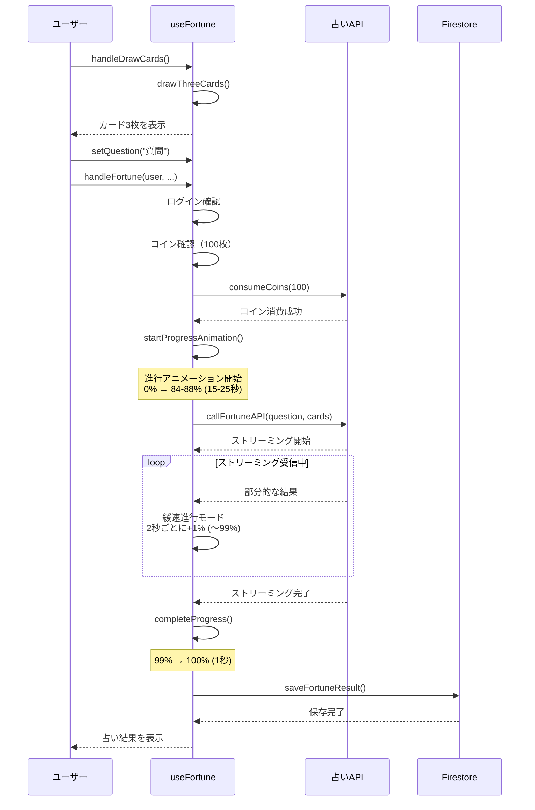

# useFortune フック仕様書

## 概要

- **作成日**: 2025-11-03
- **対象バージョン**: commit f5b3a9d
- **ファイルパス**: `frontend/src/hooks/useFortune.ts`

## 機能概要

`useFortune`は、タロット占い機能の中核となるカスタムフックです。ユーザーが質問を入力し、タロットカードを引いて占い結果を得るまでの、すべての処理を管理しています。

このフックは、以下の役割を担っています：

- ユーザーの質問とカードの状態管理
- タロットカードの抽選処理
- 占い実行時の認証とコイン残高の確認
- APIとの通信とストリーミング結果の受信
- 占い中の進行状況アニメーション制御
- エラーハンドリングとユーザーフィードバック
- 占い結果の保存と履歴管理

### 対象ユーザー

- タロット占いサービス「ヒカリノ」を利用する全てのユーザー
- 占いを実行するには、ログインとコイン（100枚）が必要です

### 主な用途

- 質問の入力と管理
- タロットカードの抽選
- 占いの実行とリアルタイム結果表示
- 占い進行中の視覚的フィードバック
- 占い結果の保存と取得

## インターフェース

### フックの使用方法

```typescript
const {
  question,
  cards,
  result,
  isLoading,
  hasFortuned,
  error,
  showWaitingAnimation,
  streamingProgress,
  setQuestion,
  handleDrawCards,
  handleFortune,
  restoreGuestData,
  resetFortune,
  setShowWaitingAnimation,
} = useFortune();
```

### 戻り値の型定義

#### 状態（State）

| プロパティ             | 型               | 説明                                       |
| ---------------------- | ---------------- | ------------------------------------------ |
| `question`             | `string`         | ユーザーが入力した質問文                   |
| `cards`                | `DrawnCard[]`    | 引いたタロットカード（最大3枚）            |
| `result`               | `string`         | 占いの結果文（AIが生成）                   |
| `isLoading`            | `boolean`        | 現在処理中かどうか                         |
| `hasFortuned`          | `boolean`        | 占いが完了したかどうか                     |
| `error`                | `string \| null` | エラーメッセージ（エラーがない場合はnull） |
| `showWaitingAnimation` | `boolean`        | 待機アニメーションを表示するかどうか       |
| `streamingProgress`    | `number`         | 進行状況（0〜100%）                        |

#### 関数（Functions）

##### setQuestion

```typescript
setQuestion: (question: string) => void
```

**説明**: ユーザーの質問を設定します。

**引数**:

- `question` (`string`): 占いで尋ねたい質問文

**使用例**:

```typescript
setQuestion("今年の仕事運はどうなりますか？");
```

##### handleDrawCards

```typescript
handleDrawCards: () => void
```

**説明**: タロットカードを3枚ランダムに抽選します。既存の占い結果はクリアされます。

**動作内容**:

1. 現在の占い結果をクリアします
2. `drawThreeCards()`を呼び出して3枚のカードを抽選します
3. 各カードについて、正位置か逆位置かをランダムに決定します

**使用例**:

```typescript
<button onClick={handleDrawCards}>カードを引く</button>
```

##### handleFortune

```typescript
handleFortune: (
  user: AuthUser | null,
  onRequireLogin: () => void,
  onRequireCoins: () => void
) => Promise<void>;
```

**説明**: 占いを実行します。認証とコイン残高を確認後、APIに質問とカード情報を送信し、ストリーミングで結果を受信します。

**引数**:

- `user` (`AuthUser | null`): 現在ログインしているユーザー情報。未ログインの場合はnull
- `onRequireLogin` (`() => void`): ログインが必要な場合に呼び出されるコールバック関数
- `onRequireCoins` (`() => void`): コインが不足している場合に呼び出されるコールバック関数

**実行条件**:

- ユーザーがログインしていること
- コインが100枚以上あること
- 他の占いが実行中でないこと

**エラーケース**:

- 未ログイン: `onRequireLogin()`を呼び出し、ゲストデータを保存
- コイン不足: `onRequireCoins()`を呼び出し
- API通信エラー: エラーメッセージを設定し、進行アニメーションを停止
- 決済エラー: 専用のエラーメッセージを表示

**使用例**:

```typescript
const user = useAuthContext();

const handleSubmit = async () => {
  await handleFortune(
    user,
    () => router.push("/login"),
    () => setShowCoinDialog(true)
  );
};
```

##### restoreGuestData

```typescript
restoreGuestData: (user: AuthUser | null) => void
```

**説明**: ゲストユーザー（未ログイン）が入力した質問とカード情報を復元します。ログイン後に以前の状態を引き継ぐために使用します。

**引数**:

- `user` (`AuthUser | null`): ログイン後のユーザー情報

**動作内容**:

- ユーザーがログインしており、かつ保存されたゲストデータがある場合のみ復元します
- 復元後、元の状態から占いを継続できます

**使用例**:

```typescript
useEffect(() => {
  if (user) {
    restoreGuestData(user);
  }
}, [user]);
```

##### resetFortune

```typescript
resetFortune: () => void
```

**説明**: すべての占い状態を初期化し、新しい占いを始められる状態にします。

**リセットされる内容**:

- 質問文
- 引いたカード
- 占い結果
- エラー状態
- 進行状況
- ゲストデータ

**使用例**:

```typescript
<button onClick={resetFortune}>もう一度占う</button>
```

##### setShowWaitingAnimation

```typescript
setShowWaitingAnimation: (show: boolean) => void
```

**説明**: 待機アニメーションの表示/非表示を制御します。

**引数**:

- `show` (`boolean`): trueで表示、falseで非表示

## 動作仕様

### 正常系フロー

#### 1. カード抽選から占い完了まで



#### 2. 進行アニメーションの詳細フロー

占い実行中は、2段階の進行アニメーションが実行されます：

**フェーズ1: 通常進行モード（0% → 84-88%）**

- 期間: 15〜25秒（ランダム）
- 最大進行率: 84〜88%（ランダム）
- 速度: 0.3〜1.2倍で変動（2〜5秒ごとに変化）
- 更新間隔: 100ミリ秒ごと

**フェーズ2: 緩速進行モード（最大% → 99%）**

- 最大進行率到達後に自動切り替え
- 2秒ごとに1%ずつ増加
- 99%で一時停止し、AI完了を待機

**フェーズ3: 完了遷移（99% → 100%）**

- AI処理完了を検知
- 1秒かけて100%に到達
- 1.5秒後に結果を表示

### エラーハンドリング

| エラーケース   | 条件                    | 動作                                                   |
| -------------- | ----------------------- | ------------------------------------------------------ |
| 未ログイン     | `user === null`         | ゲストデータを保存し、`onRequireLogin()`を呼び出し     |
| コイン不足     | `coins < 100`           | `onRequireCoins()`を呼び出し                           |
| API通信エラー  | `response.ok === false` | エラーメッセージを取得して表示、進行アニメーション停止 |
| 決済処理エラー | `consumeCoins()`が失敗  | 専用エラーメッセージを表示、進行アニメーション停止     |
| 多重実行防止   | `isLoading === true`    | 何もせずに早期リターン                                 |

### バリデーション

占い実行前に以下の確認が行われます：

- **多重実行チェック**: `isLoading`フラグで占い実行中の重複呼び出しを防止
- **ログイン確認**: `user`が存在するかチェック
- **コイン残高確認**: 100枚以上のコインがあるかチェック

## データ構造

### DrawnCard（引いたカード情報）

```typescript
interface DrawnCard {
  card: TarotCard; // カードの基本情報
  isReversed: boolean; // 正位置（false）か逆位置（true）
  position: number; // 位置（1, 2, 3）
}

interface TarotCard {
  name: string; // カード名（例: "愚者", "魔術師"）
  imagePath: string; // 画像パス（例: "/cards/0_fool.png"）
}
```

**使用例**:

```typescript
const card: DrawnCard = {
  card: {
    name: "愚者",
    imagePath: "/cards/0_fool.png",
  },
  isReversed: false, // 正位置
  position: 1, // 1枚目
};
```

### CardData（API送信用カードデータ）

```typescript
interface CardData {
  cardName: string; // カード名
  isReversed: boolean; // 正位置か逆位置か
  position: number; // 位置
}
```

**DrawnCardからの変換例**:

```typescript
const cardData: CardData = {
  cardName: drawnCard.card.name,
  isReversed: drawnCard.isReversed,
  position: drawnCard.position,
};
```

## 技術詳細

### 使用しているライブラリ・機能

- **React** (19.2.0): Hooks（useState, useCallback, useRef, useEffect）を使用
- **Firebase Auth**: ユーザー認証機能
- **Coin Context**: コイン残高の管理と消費
- **Fetch API**: ストリーミングレスポンスの受信

### 依存関係

#### 外部モジュール

- `@/types`: 型定義（DrawnCard, CardData, AuthUser）
- `@/lib/tarot`: カード抽選機能（drawThreeCards）
- `@/contexts/CoinContext`: コイン管理コンテキスト（useCoinContext）
- `@/lib/fortune`: 占いAPI通信機能
  - `callFortuneAPI`: API呼び出し
  - `processStreamingResponse`: ストリーミング処理
  - `saveFortuneResult`: 結果保存
  - `handleAPIError`: エラー処理

### パフォーマンス特性

- **進行アニメーション更新**: 100ミリ秒ごと
- **速度変更間隔**: 2〜5秒ごと
- **緩速進行**: 2秒ごとに1%増加
- **メモリ使用量**: 軽量（主にRef変数で状態管理）
- **レンダリング最適化**: useCallbackで関数をメモ化

### 制約

- **コイン消費**: 占い1回につき100枚
- **カード枚数**: 常に3枚固定
- **ログイン必須**: 占い実行にはログインが必要
- **多重実行防止**: 同時に複数の占いを実行できない

## 実装上の注意点

### 進行アニメーション管理

進行アニメーションは複雑な状態管理を行っています：

**Refを使用する理由**:

- 進行率の計算には高頻度の更新が必要
- Stateで管理すると、100ミリ秒ごとに再レンダリングが発生し、パフォーマンスが低下
- Refを使うことで、再レンダリングを最小限に抑えながら滑らかなアニメーションを実現

**管理しているRef変数**:

```typescript
// アニメーション制御
progressIntervalRef; // setIntervalのID
targetDurationRef; // 目標時間（15-25秒のランダム値）
targetMaxProgressRef; // 目標最大進行率（84-88%のランダム値）
slowIncrementModeRef; // 緩速モードフラグ
lastIncrementTimeRef; // 最後に増加した時刻
startTimeRef; // 開始時刻
aiCompletedRef; // AI完了フラグ

// 速度変動管理
virtualElapsedRef; // 仮想経過時間
currentSpeedRef; // 現在の速度
targetSpeedRef; // 目標速度
lastSpeedChangeRef; // 最後に速度変更した時刻
```

### ゲストデータの保存

未ログインユーザーがカードを引いて質問を入力した後、「占う」ボタンを押すとログイン画面に遷移します。この時、入力データを失わないようにRefで一時保存しています：

```typescript
// ログイン前のデータを保存
questionRef.current = question;
cardsRef.current = cards;

// ログイン後に復元
restoreGuestData(user);
```

### クリーンアップ処理

進行アニメーションは`setInterval`を使用しているため、適切なタイミングでクリアする必要があります：

**クリーンアップが必要なタイミング**:

1. 新しいアニメーションを開始する前
2. エラーが発生した時
3. 占いが完了した時
4. フックがアンマウントされる時
5. ユーザーが状態をリセットした時

**実装**:

```typescript
// 共通のクリーンアップ関数
const cleanupProgressInterval = useCallback(() => {
  if (progressIntervalRef.current) {
    clearInterval(progressIntervalRef.current);
    progressIntervalRef.current = null;
  }
}, []);

// コンポーネントアンマウント時
useEffect(() => {
  return () => {
    if (progressIntervalRef.current) {
      clearInterval(progressIntervalRef.current);
    }
  };
}, []);
```

### セキュリティ

- **認証確認**: 占い実行前に必ずユーザー認証を確認
- **コイン消費**: サーバーサイドで決済処理を実行（フロントエンドで完結しない）
- **トランザクション**: コイン消費が失敗した場合は占いも実行されない

### エラーメッセージの設計

ユーザーフレンドリーなエラーメッセージを提供：

```typescript
// 決済エラー
"決済処理中に問題が発生しました。コインが消費されていないか確認の上、もう一度お試しください。";

// API通信エラー
"占い中に問題が発生しました。しばらく時間をおいてから、もう一度お試しください。";

// ネットワークエラー
"インターネット接続に問題があるようです。接続を確認してから、もう一度お試しください。";
```

## 定数設定

### PROGRESS（進行アニメーション設定）

```typescript
const PROGRESS = {
  duration: {
    min: 15000, // 最小時間: 15秒
    max: 25000, // 最大時間: 25秒
  },
  percent: {
    initialTargetMin: 84, // 通常進行の最小目標値
    initialTargetMax: 88, // 通常進行の最大目標値
    finalWait: 99, // AI完了待機の進行率
    complete: 100, // 完了時の進行率
  },
  speed: {
    min: 0.3, // 最小速度倍率
    max: 1.2, // 最大速度倍率
    smoothing: 0.1, // 速度変化の滑らかさ
    changeIntervalMin: 2000, // 速度変更の最小間隔（ミリ秒）
    changeIntervalMax: 5000, // 速度変更の最大間隔（ミリ秒）
  },
  timing: {
    intervalMs: 100, // 更新間隔（ミリ秒）
    slowIncrementIntervalMs: 2000, // 緩速進行の更新間隔（ミリ秒）
    completionDelayMs: 1000, // 完了遷移の待機時間（ミリ秒）
    resultDisplayDelayMs: 1500, // 結果表示までの待機時間（ミリ秒）
  },
} as const;
```

### COIN（コイン設定）

```typescript
const COIN = {
  cost: 100, // 占い1回のコスト
} as const;
```

### ERROR_MESSAGES（エラーメッセージ）

```typescript
const ERROR_MESSAGES = {
  paymentFailed:
    "決済処理中に問題が発生しました。コインが消費されていないか確認の上、もう一度お試しください。",
} as const;
```

## テストケース

### 正常系

#### ケース1: カード抽選

**テスト内容**:

```typescript
const { cards, handleDrawCards } = useFortune();

// カードを引く
handleDrawCards();

// 検証
expect(cards).toHaveLength(3);
expect(cards[0].position).toBe(1);
expect(cards[1].position).toBe(2);
expect(cards[2].position).toBe(3);
```

**期待結果**:

- 3枚のカードが抽選される
- 各カードにposition（1, 2, 3）が設定される
- 各カードに正位置/逆位置がランダムに設定される

#### ケース2: 質問の設定

**テスト内容**:

```typescript
const { question, setQuestion } = useFortune();

setQuestion("今日の運勢は？");

expect(question).toBe("今日の運勢は？");
```

**期待結果**:

- 質問文が正しく保存される

#### ケース3: 占いの実行（ログイン済み、コイン十分）

**テスト内容**:

```typescript
const mockUser = { uid: "test-user", email: "test@example.com" };
const mockCoins = 200;

const { handleFortune, result, hasFortuned } = useFortune();

await handleFortune(mockUser, jest.fn(), jest.fn());

expect(hasFortuned).toBe(true);
expect(result).toBeTruthy();
```

**期待結果**:

- コインが100枚消費される
- APIが呼び出される
- 占い結果が取得される
- `hasFortuned`がtrueになる

### 異常系

#### ケース1: 未ログイン状態での占い実行

**テスト内容**:

```typescript
const onRequireLogin = jest.fn();
const { handleFortune } = useFortune();

await handleFortune(null, onRequireLogin, jest.fn());

expect(onRequireLogin).toHaveBeenCalled();
```

**期待結果**:

- `onRequireLogin`が呼び出される
- ゲストデータが保存される
- 占いは実行されない

#### ケース2: コイン不足での占い実行

**テスト内容**:

```typescript
const mockUser = { uid: "test-user" };
const mockCoins = 50; // 100枚未満

const onRequireCoins = jest.fn();
const { handleFortune } = useFortune();

await handleFortune(mockUser, jest.fn(), onRequireCoins);

expect(onRequireCoins).toHaveBeenCalled();
```

**期待結果**:

- `onRequireCoins`が呼び出される
- 占いは実行されない

#### ケース3: API通信エラー

**テスト内容**:

```typescript
// APIをモックして失敗させる
jest.mock("@/lib/fortune", () => ({
  callFortuneAPI: jest.fn().mockResolvedValue({ ok: false }),
}));

const mockUser = { uid: "test-user" };
const { handleFortune, error } = useFortune();

await handleFortune(mockUser, jest.fn(), jest.fn());

expect(error).toBeTruthy();
```

**期待結果**:

- エラーメッセージが設定される
- 進行アニメーションが停止する
- コインは消費されない（ロールバック）

#### ケース4: 多重実行の防止

**テスト内容**:

```typescript
const mockUser = { uid: "test-user" };
const { handleFortune, isLoading } = useFortune();

// 1回目の実行
const promise1 = handleFortune(mockUser, jest.fn(), jest.fn());

// 2回目の実行（1回目が完了する前）
const promise2 = handleFortune(mockUser, jest.fn(), jest.fn());

await Promise.all([promise1, promise2]);

// 検証: 1回しか実行されていない
expect(mockAPI).toHaveBeenCalledTimes(1);
```

**期待結果**:

- 2回目の`handleFortune`呼び出しは無視される
- APIは1回だけ呼び出される

### エッジケース

#### ケース1: ゲストデータの復元

**テスト内容**:

```typescript
const { setQuestion, handleDrawCards, handleFortune, restoreGuestData } =
  useFortune();

// ゲスト状態でデータを入力
setQuestion("将来の仕事は？");
handleDrawCards();

// ログインしようとする（ゲストデータが保存される）
await handleFortune(null, jest.fn(), jest.fn());

// ログイン後に復元
const mockUser = { uid: "test-user" };
restoreGuestData(mockUser);

expect(question).toBe("将来の仕事は？");
expect(cards).toHaveLength(3);
```

**期待結果**:

- ログイン前の質問とカードが復元される

#### ケース2: アニメーション完了前のリセット

**テスト内容**:

```typescript
const { handleFortune, resetFortune, streamingProgress } = useFortune();

// 占いを開始
await handleFortune(mockUser, jest.fn(), jest.fn());

// 途中でリセット
resetFortune();

expect(streamingProgress).toBe(0);
expect(question).toBe("");
expect(cards).toHaveLength(0);
```

**期待結果**:

- 進行アニメーションが停止する
- すべての状態がリセットされる

## 変更履歴

| 日付       | コミット | 変更内容                                                                   |
| ---------- | -------- | -------------------------------------------------------------------------- |
| 2025-11-03 | f5b3a9d  | マジックナンバーの定数化、重複コードの削除、関数の分割による可読性向上     |
| 2025-11-03 | 4dc2a5d  | 進行アニメーションの仕様変更（最大値を84-88%に変更、緩速進行モードの実装） |
| 2025-11-03 | 1782b68  | 進行バーのUI実装（横方向プログレスバーに変更）                             |

## 関連ドキュメント

- [型定義仕様書](./types-spec.md)（未作成）
- [占いAPI仕様書](./fortune-api-spec.md)（未作成）
- [コインシステム仕様書](./coin-system-spec.md)（未作成）

## 補足事項

### 進行アニメーションの設計意図

占い実行中の進行アニメーションは、単なる視覚的なフィードバック以上の役割を持っています：

1. **体感待ち時間の短縮**: 進行バーが動くことで、ユーザーは「処理が進んでいる」と感じ、待ち時間を短く感じます

2. **自然な演出**: 可変速度（0.3〜1.2倍）を採用することで、機械的な一定速度ではなく、人間らしい「考えている」感じを演出しています

3. **リアルタイム性の強調**: AI処理の完了に合わせて99%→100%に遷移することで、「本当に今、AIが占っている」という臨場感を生み出しています

4. **不安の軽減**: 進行率が表示されることで、「いつまで待てばいいのか」という不安が軽減されます

### カスタムフックの設計哲学

このフックは「関心の分離（Separation of Concerns）」の原則に基づいて設計されています：

- **UIロジックとビジネスロジックの分離**: コンポーネントはUIの表示に専念し、占いの処理ロジックはこのフックに集約
- **再利用性**: 複数のコンポーネントから同じ占い機能を利用可能
- **テスタビリティ**: フックを独立してテストできる
- **保守性**: 占い機能の修正はこのフック1箇所で完結

このアプローチにより、コードの保守性と可読性が大幅に向上しています。
