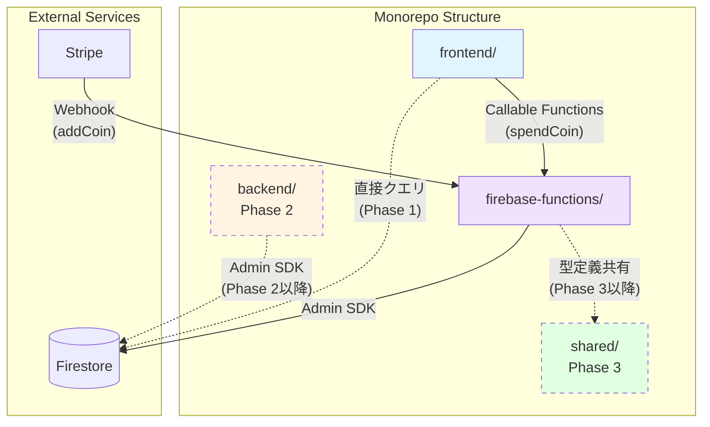
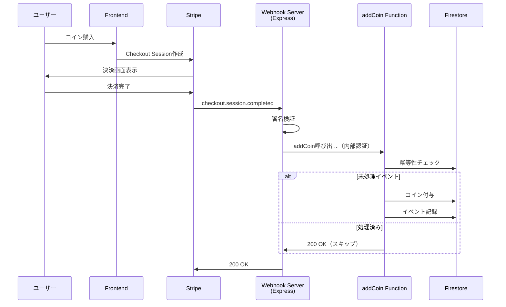

# Firebase Functions

## 概要

本ディレクトリはHikarinoプロジェクトにおけるFirebase Functions（Cloud Functions for Firebase）を管理し、イベント駆動型のサーバーレス処理を担当する。Firebaseエコシステムに特化した機能のみに責務を絞り、Firestoreトリガー、HTTP呼び出し可能関数、Webhook処理を提供する。

## アーキテクチャ上の位置づけ

Hikarinoモノレポにおいて、本ディレクトリは以下の責務を持つ：

- **イベント駆動処理**: Firestore変更、認証イベント等への自動応答
- **Callable Functions**: フロントエンドから直接呼び出し可能な認証済み関数
- **Webhook受信**: 外部サービス（Stripe等）からのイベント通知処理

### 設計原則

1. **Firebase中心主義**: Firebase/GCP固有の機能のみに特化し、汎用的なREST APIは含まない
2. **イベント駆動**: リクエスト/レスポンス型ではなく、イベントに反応する処理を優先
3. **疎結合**: フロントエンドおよび将来のバックエンドAPIとは独立して動作
4. **冪等性保証**: 同一イベントの重複処理を防ぐ仕組みを実装

## 技術スタック

| カテゴリ             | 技術                         | バージョン | 用途                  |
| -------------------- | ---------------------------- | ---------- | --------------------- |
| **プラットフォーム** | Cloud Functions for Firebase | v2         | サーバーレス実行環境  |
| **ランタイム**       | Node.js                      | 18+        | JavaScript実行環境    |
| **言語**             | TypeScript                   | 5.x        | 型安全性              |
| **SDK**              | Firebase Admin SDK           | 12.x       | Firestore、Auth操作   |
| **フレームワーク**   | Express                      | 4.x        | Webhook用HTTPサーバー |
| **決済**             | Stripe                       | 18.x       | Webhook署名検証       |

## ディレクトリ構造

```
firebase-functions/
├── src/
│   ├── index.ts              # エントリポイント（Functions定義）
│   ├── types/                # TypeScript型定義
│   └── webhook/              # Webhook処理モジュール
│       ├── server.ts         # Expressサーバー（ポート3001）
│       └── stripe.ts         # Stripe署名検証ロジック
├── package.json              # 依存関係定義
├── tsconfig.json             # TypeScript設定
├── .eslintrc.js              # ESLint設定
├── .gcloudignore             # デプロイ除外設定
└── README-WEBHOOK.md         # Webhook詳細ドキュメント
```

## 提供している関数

### 1. spendCoin（Callable Function）

**種別**: `onCall`
**用途**: フロントエンドからのコイン消費リクエスト処理

```typescript
export const spendCoin = onCall(async (request: CallableRequest) => {
  // 認証必須
  // コイン残高チェック
  // Firestore更新
});
```

**呼び出し方**:

```typescript
// フロントエンド側
import { getFunctions, httpsCallable } from "firebase/functions";
const functions = getFunctions();
const spendCoin = httpsCallable(functions, "spendCoin");
const result = await spendCoin({ amount: 100 });
```

### 2. addCoin（HTTP Function）

**種別**: `https.onRequest`
**用途**: Stripe Webhook経由のコイン付与処理

```typescript
export const addCoin = functions.https.onRequest(async (req, res) => {
  // 内部認証キー検証
  // Stripe署名検証
  // 冪等性チェック
  // Firestoreコイン付与
});
```

**特徴**:

- 冪等性保証（同一イベントIDの重複処理を防止）
- 内部認証キーによるアクセス制限
- `processed_webhook_events` コレクションでイベント管理

## 他ディレクトリとの関係



### データフロー例: コイン購入



## 依存関係

### 実行時依存

- **Firestore**: ユーザーコイン残高、処理済みイベント記録
- **Firebase Authentication**: Callable Functionsの認証
- **Stripe**: Webhook署名検証

### 開発時依存

- **frontend/**: Callable Functions経由でコイン消費を呼び出し
- **shared/**: 型定義の共有（Phase 3以降）

### 独立性の原則

本ディレクトリは他のディレクトリのコードを直接importしない。
全ての連携はFirebase SDK、HTTP、または環境変数を通じて行い、疎結合を維持する。

## デプロイ

### 前提条件

- Firebase CLIのインストール: `npm install -g firebase-tools`
- Firebaseプロジェクトへのログイン: `firebase login`

### コマンド

```bash
# 全Functions デプロイ
firebase deploy --only functions

# 特定の関数のみデプロイ
firebase deploy --only functions:spendCoin
firebase deploy --only functions:addCoin
```

### 環境変数設定

```bash
# Firebase Functions Secrets設定
firebase functions:secrets:set STRIPE_SECRET_KEY
firebase functions:secrets:set STRIPE_WEBHOOK_SECRET
firebase functions:secrets:set INTERNAL_WEBHOOK_KEY
```

## ローカル開発

### Webhookサーバー起動

```bash
cd firebase-functions
npm install
npm run webhook:dev  # ポート3001で起動
```

### Functions Emulator

```bash
firebase emulators:start --only functions
```

## セキュリティ

### 認証レベル

| 関数        | 認証方法                | アクセス元     |
| ----------- | ----------------------- | -------------- |
| `spendCoin` | Firebase Authentication | フロントエンド |
| `addCoin`   | 内部認証キー            | Webhook Server |

### 環境変数管理

**重要**: 以下の秘密情報はGitにコミットしない

- `STRIPE_SECRET_KEY`: Stripe APIキー
- `STRIPE_WEBHOOK_SECRET`: Webhook署名検証用
- `INTERNAL_WEBHOOK_KEY`: addCoin関数の内部認証用

## バックエンドAPIとの棲み分け

### Firebase Functions（このディレクトリ）

- Firestore/Auth トリガー
- Callable Functions（認証済みRPC）
- Webhook受信
- イベント駆動処理

### Backend API（Phase 2以降）

- REST API エンドポイント
- ビジネスロジックの集約
- 複雑なクエリ処理
- 外部API統合（OpenAI等）

**原則**: Firebase固有の機能 → `firebase-functions/`、汎用的なAPI → `backend/`

## 関連ドキュメント

- [Webhook詳細設計](./README-WEBHOOK.md): Stripe Webhook実装の詳細
- [プロジェクトルートREADME](../README.md): 全体概要
- [フロントエンドREADME](../frontend/README.md): フロントエンドとの連携
- [PR #90](https://github.com/Sina-TehraniFard/hikarino/pull/90): モノレポ移行の背景

---

**Phase**: 2/4 完了
**最終更新**: 2025-10-28
