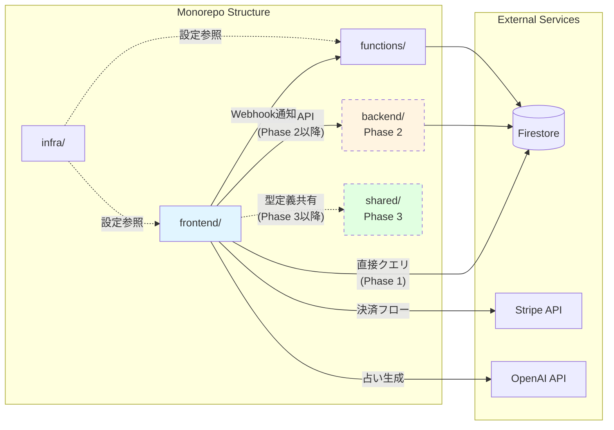

# Frontend

## 概要

本ディレクトリはHikarinoプロジェクトのフロントエンド層を担当し、モノレポ構成における独立したサブプロジェクトとして機能する。Next.js App Routerを基盤とし、ユーザーインターフェースとクライアントサイドのロジックを集約している。

## アーキテクチャ上の位置づけ

Hikarinoモノレポにおいて、本ディレクトリは以下の責務を持つ：

- **プレゼンテーション層**: ユーザーインターフェースの提供
- **クライアントサイドロジック**: 状態管理、フォームバリデーション、アニメーション制御
- **API統合層**: バックエンドAPIおよびCloud Functionsとの通信

### 設計原則

1. **関心の分離**: ビジネスロジックはバックエンドに委譲し、フロントエンドはUIとUXに専念
2. **独立性**: 他のディレクトリ（backend, functions）に依存せず、APIを通じて疎結合に連携
3. **型安全性**: TypeScriptによる厳格な型チェックと、将来的な`shared/types`との統合

## 技術スタック

| カテゴリ           | 技術          | バージョン | 用途                            |
| ------------------ | ------------- | ---------- | ------------------------------- |
| **フレームワーク** | Next.js       | 15.5.4     | フルスタックReactフレームワーク |
| **ランタイム**     | React         | 19.2.0     | UIライブラリ                    |
| **言語**           | TypeScript    | 5.x        | 型安全性                        |
| **スタイリング**   | Tailwind CSS  | 4.x        | ユーティリティファーストCSS     |
| **ビルドツール**   | Turbopack     | -          | 高速バンドラー（Next.js内蔵）   |
| **認証**           | Firebase Auth | 11.6.1     | ユーザー認証                    |
| **データベース**   | Firestore     | 11.6.1     | クライアントサイドクエリ        |
| **決済**           | Stripe        | 18.1.0     | コイン購入フロー                |
| **AI**             | OpenAI API    | 4.96.0     | 占い結果生成                    |

## ディレクトリ構造

```
frontend/
├── src/
│   ├── app/                    # Next.js App Router
│   │   ├── api/               # API Routes（将来的にbackend/へ移行予定）
│   │   ├── history/           # 占い履歴ページ
│   │   ├── privacy/           # プライバシーポリシー
│   │   ├── terms/             # 利用規約
│   │   ├── tokusho/           # 特定商取引法ページ
│   │   └── page.tsx           # トップページ
│   ├── components/            # Reactコンポーネント
│   │   ├── ui/               # 再利用可能なUIコンポーネント
│   │   └── *.tsx             # フィーチャーコンポーネント
│   ├── contexts/             # React Context（状態管理）
│   ├── hooks/                # カスタムフック
│   ├── lib/                  # ユーティリティ・ヘルパー
│   │   ├── firebase.ts       # Firebase初期化
│   │   ├── firestore/        # Firestoreクエリ
│   │   ├── fortune.ts        # 占いビジネスロジック
│   │   ├── fortuneAnalytics.ts # 占い分析機能
│   │   └── tarot.ts          # タロットカード定義
│   ├── prompts/              # AIプロンプトテンプレート
│   └── types/                # TypeScript型定義
├── public/                    # 静的アセット
├── pages/                     # Pages Router（レガシーAPI Routes用）
├── package.json              # 依存関係定義
├── next.config.ts            # Next.js設定
├── tailwind.config.ts        # Tailwind CSS設定
└── tsconfig.json             # TypeScript設定
```

## 他ディレクトリとの関係



### データフロー

**Phase 1（現在）**: フロントエンド → Firestore直接クエリ + API Routes

**Phase 2以降**: フロントエンド → バックエンドAPI → Firestore

この移行により、以下を実現：

- ビジネスロジックのサーバーサイド集約
- セキュリティの向上（クライアント側のFirestoreアクセス制限）
- 複数フロントエンド（Web, モバイル）への対応準備

## 依存関係

### 実行時依存

- **functions/**: Stripe Webhookによるコイン付与通知を受信
- **Firestore**: ユーザーデータ、占い履歴、コイン残高の読み書き
- **外部API**: Stripe決済、OpenAI占い生成

### 開発時依存

- **infra/firebase**: Firestore Rulesの参照
- **shared/**: 型定義の共有（Phase 3以降）

### 独立性の原則

本ディレクトリは`backend/`や`functions/`のコードを直接importしない。
全ての連携はHTTP API、Firebase、または環境変数を通じて行い、疎結合を維持する。

## 関連ドキュメント

- [プロジェクトルートREADME](../README.md): 全体概要
- [PR #90](https://github.com/Sina-TehraniFard/hikarino/pull/90): フロントエンド分離の詳細

---

**Phase**: 1/4 完了
**最終更新**: 2025-10-28
